+++
author = "Enzo"
title = "Chall - Insider"
date = "2026-09-03"
categories = [
    "Blue Team"
]
tags = [
    "Windows",
    "Forensic",
    "CTF",
    "Chall",
    "CyberDefenders",
    "FTK Imager", 
    "Disque"
]
+++
# Chall - Insider
Ce chall est proposé par la plateforme [cyberdefenders.org](https://cyberdefenders.org). 

*Les flags ne seront pas donné dans leur intégralité. 

## Scénario

Après que Karen a commencé à travailler pour « TAAUSAI », elle a commencé à mener des activités illégales au sein de l’entreprise. « TAAUSAI » vous a engagé en tant qu’analyste SOC afin de lancer une enquête sur cette affaire.

Vous avez obtenu une image disque et découvert que Karen utilise un système d’exploitation Linux sur son ordinateur. Analysez l’image disque de l’ordinateur de Karen et répondez aux questions fournies.

## Outils
Pour ce CTF nous allons utilisé ``FTK Imager``, c'est un utilitaire très connu en forensique numérique. Il nous permet de faire de la capture de disque et mémoire, une fois capturé, nous pouvons l'analyser avec ``FTK Imager``. Ce qui en fait un outil complet, même s'il est critiqué car il fait le même travail que `dd` mais en rajoutant des sur couche ce qui le rend plus lourd mais en même temps plus agréable à manier.

## Recherche
1. Quelle est la distribution Linux ? Pour trouver cette info, nous devons nous rendre dans le dossier `/boot/` pour avoir l'information 
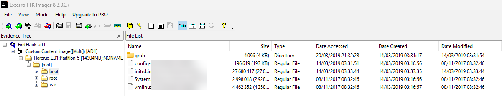

2. Quel est le hash MD5 du fichier `access.log` du service apache ? Les fichiers de log Apache sont dans le repertoire `/var/log/apache2`, une fois le fichier ``access.log`` trouvé, nous pouvons faire un clique droit sur celui ci et ensuite faire un `Export File` : 
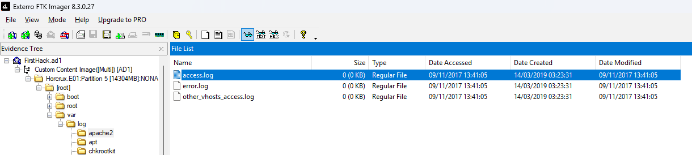 
Pour finir, avec un utilistaire comme `HashTab` (sur windows) nous pouvons ragarder le "Checksum" md5 du fichier : 
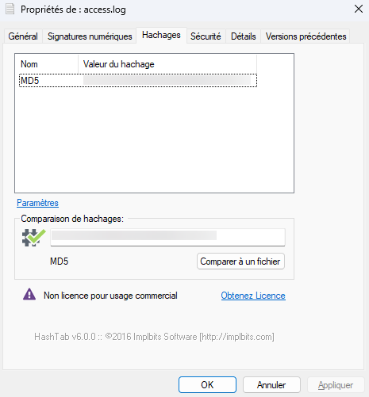

3. On soupçonne qu’un outil d’extraction d’identifiants a été téléchargé. Quel est le nom du fichier téléchargé ? Pour savoir quel outil a été téléchargé, il nous suffit d'aller dans `/root/Downloads`, l'attaquant n'a pas pensé à supprimer ses traces, nous pouvons voir clairement l'outil : 
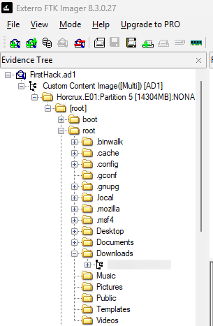

4. Un fichier super secret a été créé, quel est le chemin absolu de celui-ci ? Pour voir quel fichier a été créé, nous pouvons avec dans le fichier `/root/.bash_history`, si le fichier a été créé en ligne de commande, cette dernière apparaîtra ici :  
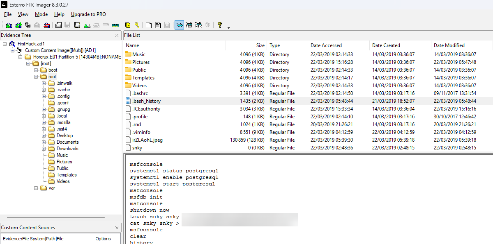

5. Quel programme utilise le fichier `didyouthinkwedmakeiteasy.jpg` ? Pour ça, nous pouvons également voir dans fichier ``.bash_history`` : 
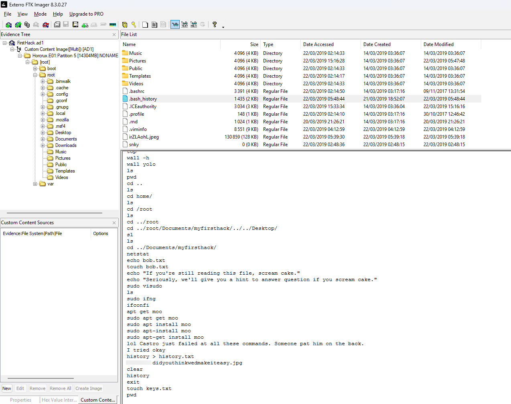

6. Quel est le 3ème but de la checklist de karen ? Pour ça nous devons fouiller dans dossier de l'utilisateur (qui utilise uniquement l'utilisateur `root`), dans la plus part des cas les utilisateurs utilise leur Bureau pour créer des fichier/dossier, c'est plus simple pour eux pour s'y retrouver, nous allons donc chercher là bas : 
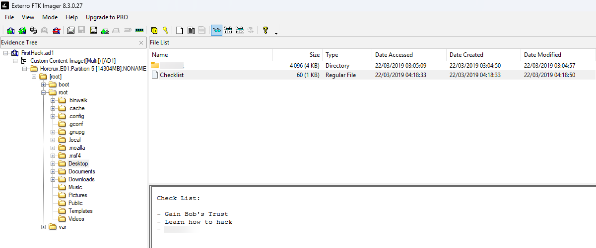

7. Combien de fois le service `Apache` a été lancé ? Pour ce genre de résultat je ne peut pas chacher le flag ... il faut donc se rendre dans `/var/log/apache2` pour voir que les logs d'apache sont à 0, ce qui prouve que le service apache n'a jamais été démarré : 
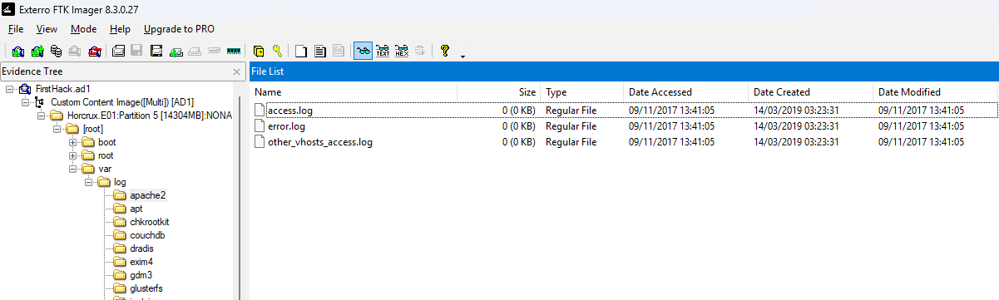

8. Cette machine a été utilisée pour lancer une attaque contre une autre machine. Quel fichier contient les preuves de cette attaque ? En explorant le dossier utilisateur (root) nous pouvons voir une image, en l'ouvrant cela nous donne une capture d'écran d'un bureau windows. 
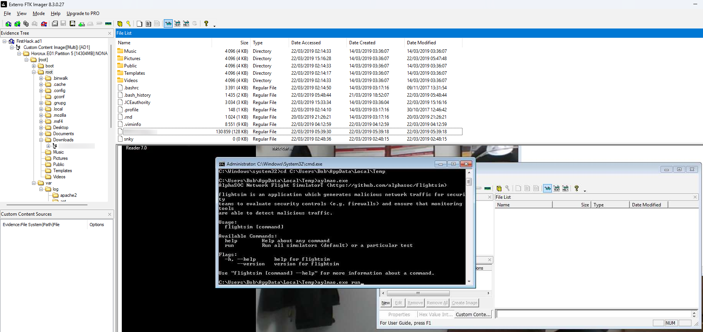

9. On pense que Karen se moquait d’un autre expert en informatique au moyen d’un script Bash situé dans le répertoire Documents. Quel était le nom de l’expert que Karen énervait ?
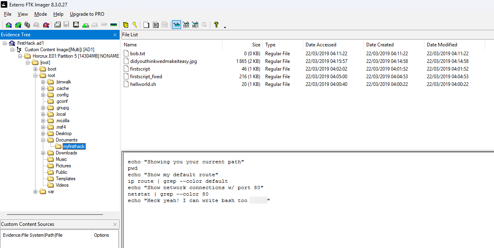

10. Un utilisateur a exécuté plusieurs fois la commande `su` à 11 h 26 pour obtenir les privilèges root. Quel était cet utilisateur ? pour voir ça, il faut se rendre dans le fichier `/var/log/auth.log` et rechercher les commande `su` (celle réussie et les échouée)
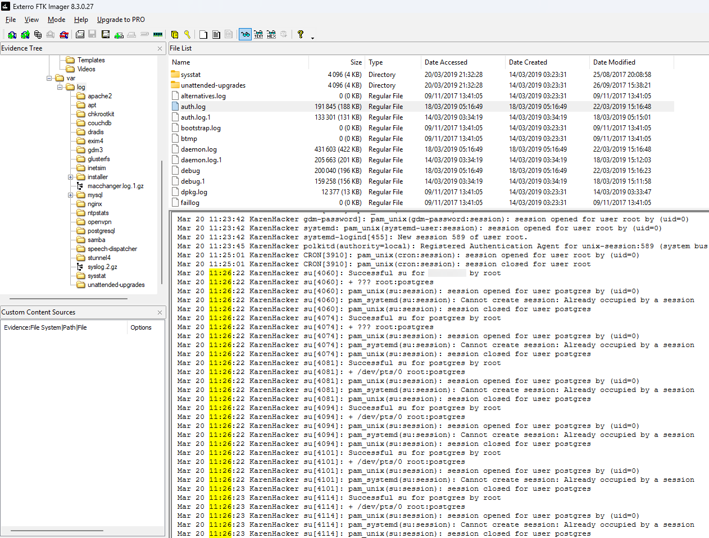

11. D’après l’historique Bash, quel est le répertoire de travail actuel ? Pour trouver les repertoire courant actuel il faut se rendre dans `/root/.bash_history` et chercher les derniers `cd`
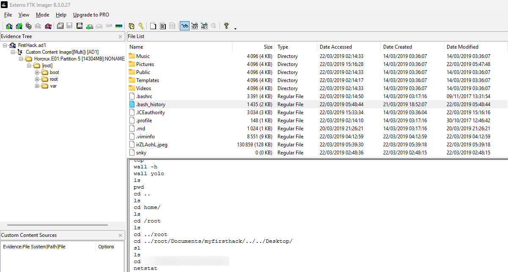