+++
author = "Enzo"
title = "Chall - LockDown"
date = "2026-08-11"
categories = [
    "Blue Team"
]
tags = [
    "Windows",
    "Forensic",
    "CTF",
    "Chall",
    "Volatility",
    "CyberDefenders",
    "WireShark",
    "SAST",
    "DAST"
]
+++
# Chall - LockDown
Ce chall est proposé par la plateforme [cyberdefenders.org](https://cyberdefenders.org). 

*Les flags ne seront pas donné dans leur intégralité. 
## Scénario
Le SOC de TechNova Systems a détecté un trafic sortant suspect provenant d’un serveur IIS exposé sur Internet, hébergé dans sa plateforme cloud — une activité laissant penser au dépôt d’un web shell et à l’établissement de connexions furtives vers un hôte inconnu.

En tant qu’analyste forensique, vous disposez de trois artefacts essentiels : un fichier PCAP capturant le trafic initial, une image complète de la mémoire du serveur et un échantillon de malware récupéré sur le disque. Reconstituez l’intrusion ainsi que l’ensemble des activités de l’attaquant afin que TechNova puisse contenir la compromission et renforcer ses défenses.

## Analyse du PCAP
Pour réaliser cette partie, nous avons seulement besoin de WireShark.
Cette partie ce décompose en 5 questions : 
1. Après avoir submergé l’hôte IIS de sondes envoyées à un rythme soutenu, l’attaquant révèle son origine. Quelle adresse IP a généré ce trafic de reconnaissance ?
Sachant que le service IIS est un service web, nous avons seulement à regarder les requêtes http(s) pour voir quelle IP a tenté un scan : 
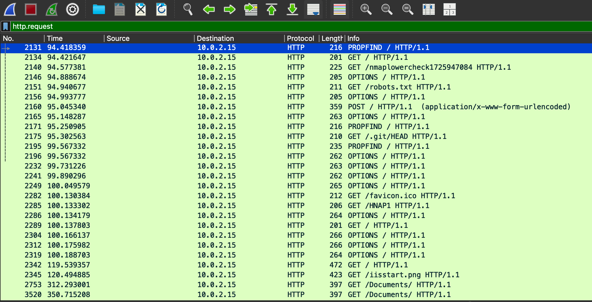
Ici c'est l'IP 10.0.2.XXX qui a tenté un scan. 

2. L’attaquant effectue une énumération ciblée du service HTTP sur l’hôte IIS. D’après les en-têtes des requêtes HTTP, quel outil est utilisé ?
Les outils les plus connu laisse toujours une trace reconnaissable ... Ici il suffit de regarder les en-têtes http pour voir le nom de l'outil : 
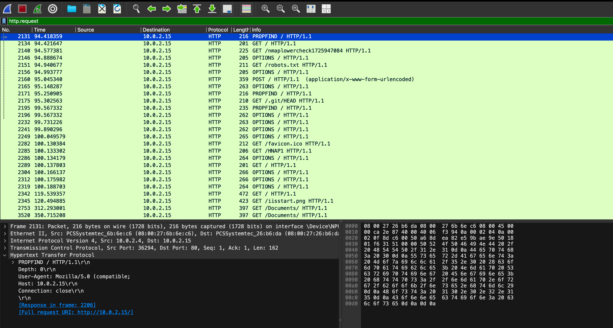
Ici, c'est l'outil XXXX qui a été utilisé.

3. En examinant le trafic SMB, vous observez deux requêtes Tree Connect consécutives qui révèlent les premiers partages sondés par l’intrus sur l’hôte IIS. Quels sont les deux chemins UNC complets auxquels il accède ?
Pour analyser le trafic SMB il nous suffit de lancer la requête suivante : `smb || smb2`
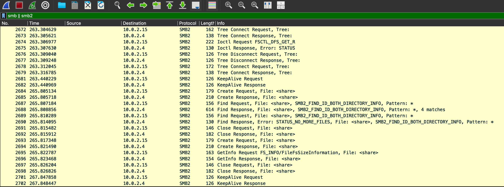
Avec cette requête, nous pouvons voir que les paratges découvert par l'intru sont : 
\\10.0.2.15\XXXXXXXXX
\\10.0.2.15\XXXX

4. Dans le partage, l’attaquant dépose une charge utile accessible via le Web, qui lui permettra d’exécuter du code à distance. Quel est le nom du fichier malveillant qu’il a téléversé ?
Pour voir ce que l'attaquant a posté sur le serveur SMB il nous suffit de rester avec la requête actuelle et de descendre un peu pour checker quel fichier à été "POST" vers le serveur : 
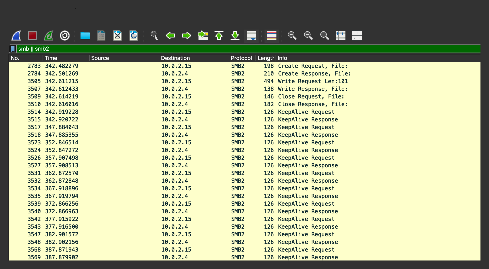
Et là nous pouvons voir que le fichier est : XXXXX.XXXX

5. Le shell récemment installé se connecte à l’attaquant via un port inhabituel, mais autorisé par le pare-feu. Quel port d’écoute l’attaquant a-t-il utilisé pour le reverse shell ?
Alors ici il y a plusieurs façon, la plus simple, brute-force les possibilité (généralement pour un shell on utilise : 8080, 9090, 4443, 4444 ...) ici la réponse était l'une des propositions de base ... 
Sinon il y a la méthode "propre" : `ip.src == 10.0.2.15 && ip.dst == <IP_attaquant> && tcp.flags.syn==1 && tcp.flags.ack==0` cette requête nous renvoie le bon résultat : 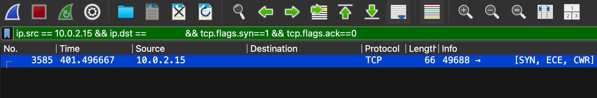

Et voilà la première partie a été analysé avec succès. 
Passons maintenant à l'analyse mémoire. 

## Analyse Mémoire
Pour cette partie je vais utiliser Volatility, mais pas sous ça forme originel. J'ai un ami qui a développé un outil qui permet de facilité et d'automatisé cette partie, tout en s'appuyant sur le framework Volatility. Cet outil s'appel `multivol`, il va nous permettre de lancer tout les plug-in de Volatility3 avec une interface web claire. Voici le lien du repo [https://github.com/BoBNewz/MultiVolatility](https://github.com/BoBNewz/MultiVolatility). 
Il suffit de faire une `git clone` puis un `docker compose up` et le conteneur se monte automatiquement. 

Passons au challenge. 

1. Votre instantané mémoire capture le noyau du système en fonctionnement, fournissant un contexte essentiel sur la compromission. Quelle est l’adresse de base du noyau dans le dump ?
Pour cette première question, c'est le plug-in `windows.info.Info` qui va nous intéresser : 
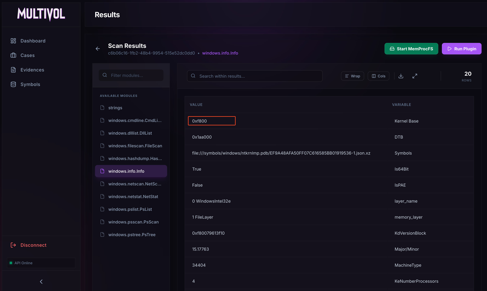

2. Un service de confiance lance un exécutable inhabituel situé en dehors de la pile IIS habituelle, ce qui indique la présence d’un implant de persistance. Quel est le chemin complet final de cet exécutable sur le disque ?
Pour voir quel binaire a été executé, nous pouvons utiliser le plug-in `windows.cmdline.CmdLine` :
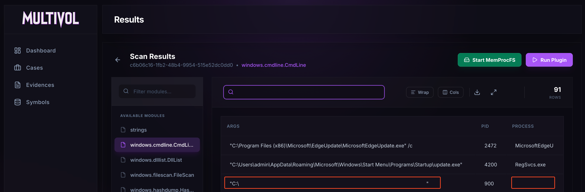

3. Le trafic sortant du shell inversé est géré par un processus Windows intégré qui lance également l’exécutable implanté. Quel est le nom de ce processus et sous quel PID s’exécute-t-il ?
Ici, nous aurons besoin du plug-in `windows.netscan.NetScan` ainsi que des recherches précédentes (celles avec WireSherk) pour y obtenir le port de recherche. Nous avons donc juste à rechercher le bon port pour y obtenir le Processus et le PID :
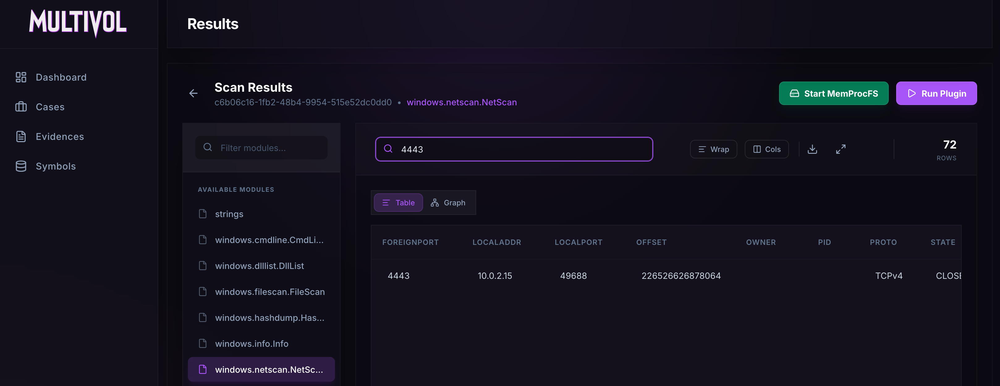

Pour finir sur cette partie, j'aimerais préciser que cet outil (`multivol`) est extrêmement intéressant, mais qu'il faut d'abord savoir utilisé volatility, car `multivol` mâche énormément le travail. 

## Analyse de Binaire
Pour cette dernière partie, nous alons avoir besoin de 2 outils, la commande `file` et `AnyRun`.

1. L’inspection statique révèle que le binaire a été compressé afin de rendre son analyse plus difficile. Quel packer a été utilisé pour l’obfusquer ?
C'est ici que `file` va nous servir, en effet nous avons cette info avec cette commande : 
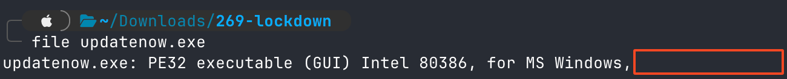

2. L’analyse des renseignements sur les menaces montre que le logiciel malveillant communique avec son serveur de commande et de contrôle. Quel nom de domaine pleinement qualifié (FQDN) contacte-t-il ?
C'est à partir de ce moment que `AnyRun` va nous servir. C'est une plateforme gratuite (il suffit d'avoir un compte) qui va nous permettre d'executer des `.exe` dans un environnement contrôlé afin de pouvois savoir ce qu'a fait un executable. Commençons par cette première question : 
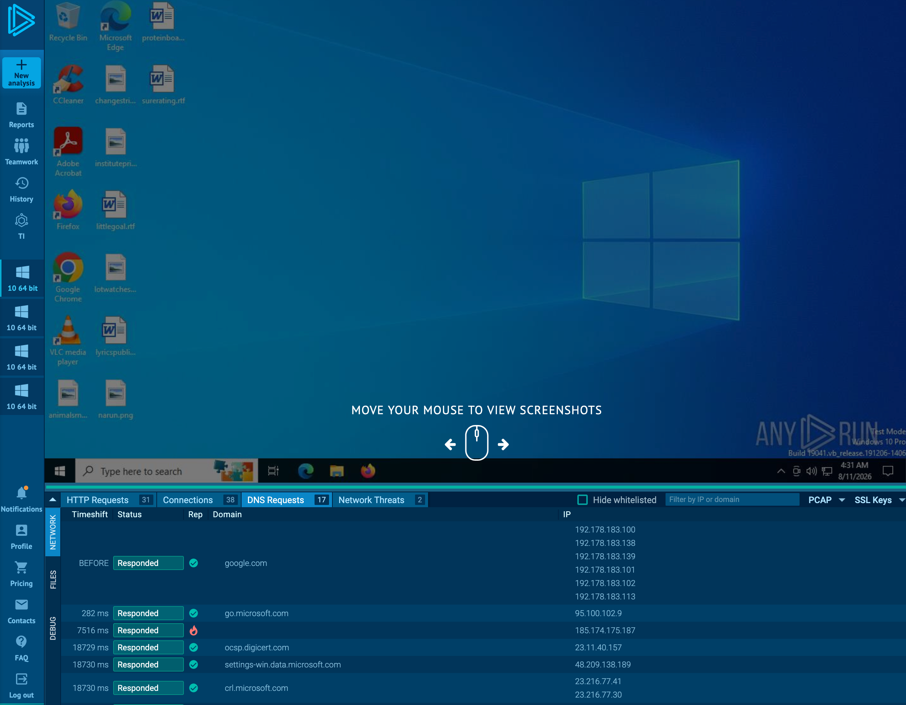
Ici la requête qui nous intéresse est celle avec la flamme (annoté par AnyRun comme suspecte). 

3. Les renseignements open source associent ce hachage à un RAT commercial bien connu. À quelle famille de logiciels malveillants l’échantillon appartient-il ?
`AnyRun` nous mâche encore le travail, il nous donne la famille à la quelle ce RAT appartient : 
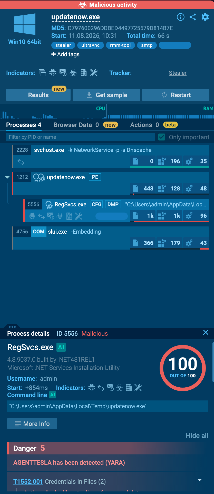

Et voilà, ce chall a été résolu à 100%. 
Même si ce challenge est classé "Easy" il permet de retravailler les basiques ce qui n'a que des effets positif. 
