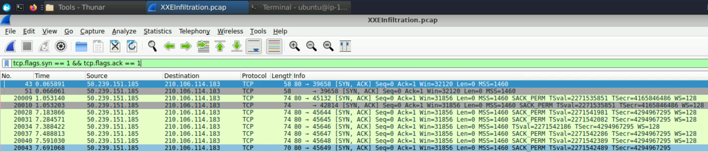
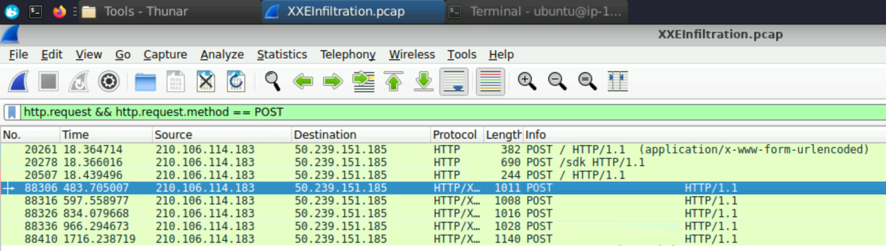
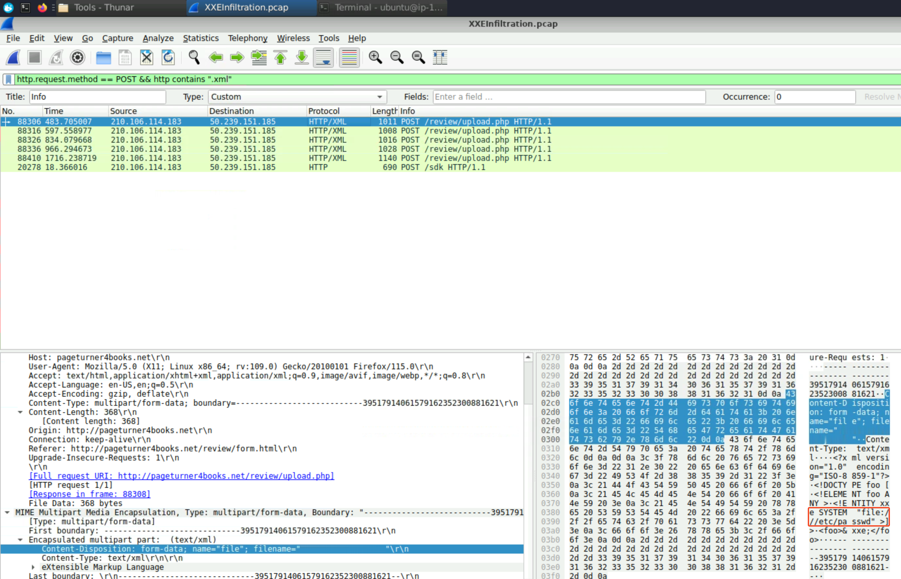
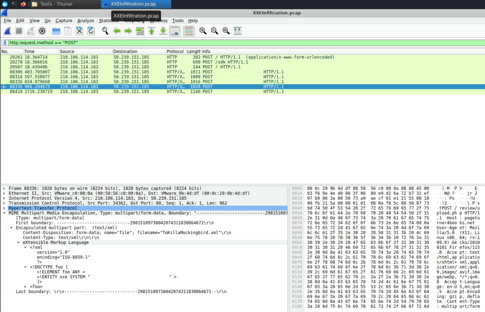
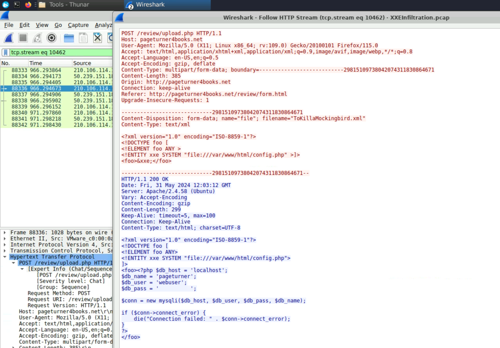
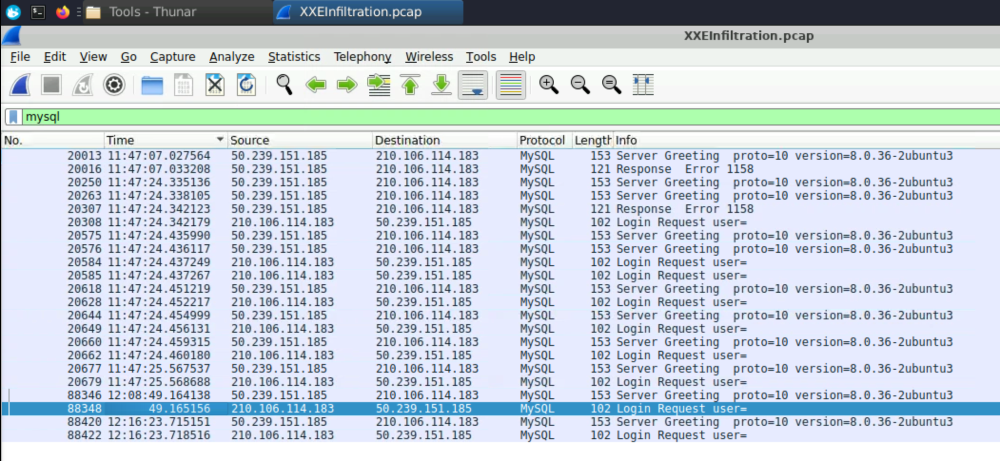
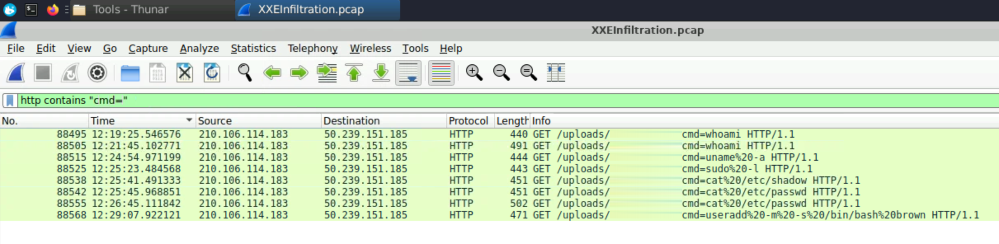

+++
author = "Enzo"
title = "Chall - XXE Infiltration"
date = "2026-08-14"
categories = [
    "Blue Team"
]
tags = [
    "Windows",
    "Forensic",
    "CTF",
    "Chall",
    "CyberDefenders",
    "WireShark",
    "DAST"
]
+++
# Chall - XXE Infiltration
Ce chall est proposé par la plateforme [cyberdefenders.org](https://cyberdefenders.org). 

*Les flags ne seront pas donné dans leur intégralité. 

## Scénario

Une alerte automatisée a détecté le traitement de données XML inhabituelles par le serveur, ce qui laisse penser à une potentielle attaque par injection XXE (*XML External Entity*). Cela soulève des inquiétudes concernant l’intégrité des données clients de l’entreprise et de ses systèmes internes, nécessitant une enquête immédiate.

Analysez le fichier PCAP fourni à l’aide des outils d’analyse réseau dont vous disposez. Votre objectif est d’identifier comment l’attaquant a obtenu l’accès et quelles actions il a effectuées.

## Recherche

1. Identifier les ports ouverts découverts par un attaquant nous aide à comprendre quels services sont exposés et potentiellement vulnérables. Pouvez-vous identifier le port portant le numéro le plus élevé qui est ouvert sur le serveur web de la victime ?
Pour trouver le port connexion nous pouvons rechercher `tcp.flags.syn == 1 && tcp.flags.ack == 1` (ou `tcp.flags == 0x012` qui est la même commande mais plus courte, elle correspond également au à un échange `SYN-ACK`) dans WireShark, nous avons ce résultat : 
 

2. Pour établir la chronologie de l’attaque et déterminer le point initial de compromission, quel est le nom du premier fichier XML malveillant téléversé par l’attaquant ? Pour répondre à cette question nous pouvons rechercher toutes les requêtes `http` en `POST` ce qui nous donne la reqête suivante `http.request && http.request.method == POST` : 

3. Pour établir la chronologie de l’attaque et déterminer le point initial de compromission, quel est le nom du premier fichier XML malveillant téléversé par l’attaquant ?

Ici, nous pouvons voir que cette page tente d'accéder à `/etc/passwd` ce qui n'est pas un comportement normal... 

4. Comprendre les fichiers sensibles auxquels l’attaquant a accédé permet d’évaluer l’impact potentiel de la fuite. Quel est le nom du fichier de configuration de l’application web que l’attaquant a lu ? Pour voir les fichier consulté, nous avons juste suivre les 

5. Pour évaluer l’ampleur de la compromission, quel est le mot de passe de l’utilisateur de la base de données compromis ? POur retrouver le mot de passe, nous pouvons aller dans le fichier de configuration retrouvé juste avant et de faire un `Follow` > `HTTP Stream` : 

6. Après la compromission de l’utilisateur de la base de données, quel est l’horodatage de la première connexion de l’attaquant au serveur MySQL avec les identifiants compromis, après leur divulgation ? La lecture des credentials a eut lieu à `12:03` la tentative de connexion suivante à été réalisé à `12:XX` c'est donc notre timestamp : 

7. Pour éliminer la menace et empêcher tout nouvel accès non autorisé, pouvez-vous identifier le nom du web shell que l’attaquant a téléversé pour exécuter du code à distance et maintenir sa persistance ? En général, les web shell envoie les commandes avec un arguments `cmd=` puis la commande, il nous suffit de rentrer la requête `http contains "cmd="` ce qui nous donne le résulatat suivant : 

Cela nous donne donc le nom plus l'extension du Web Shell.