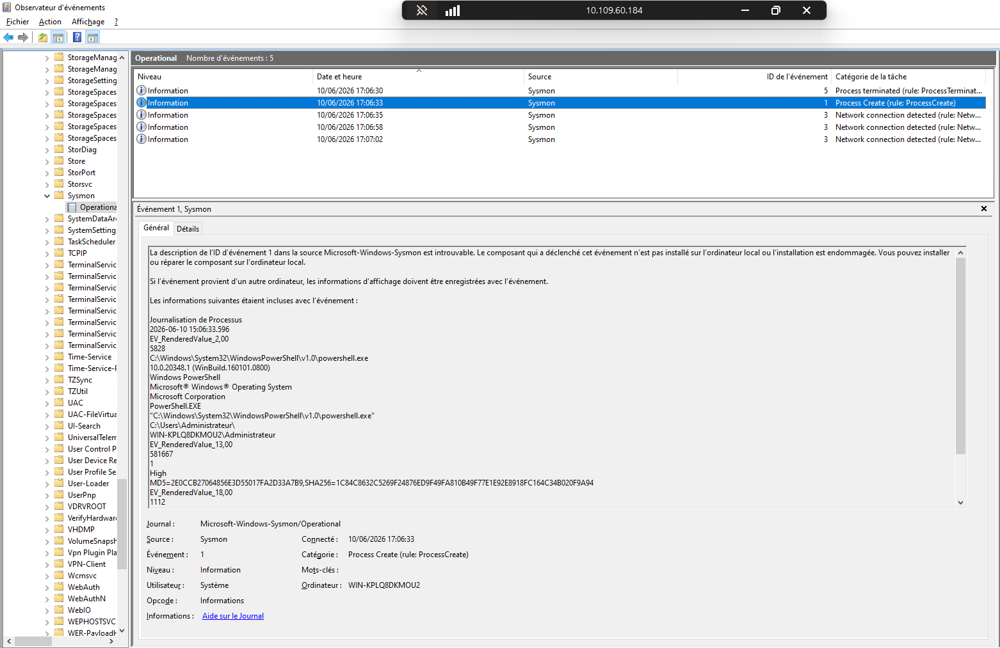
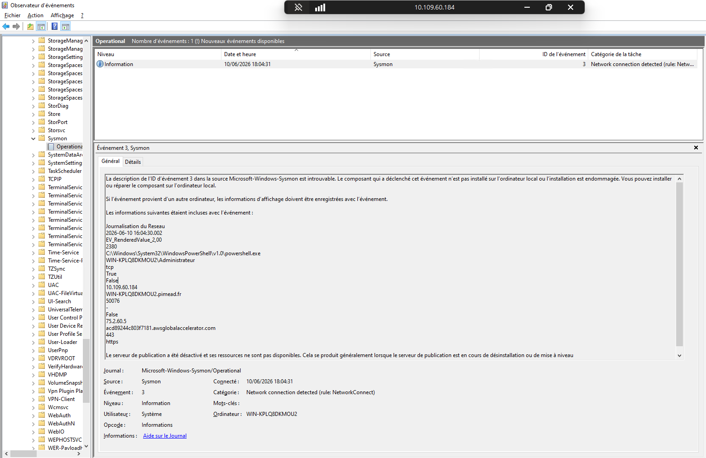
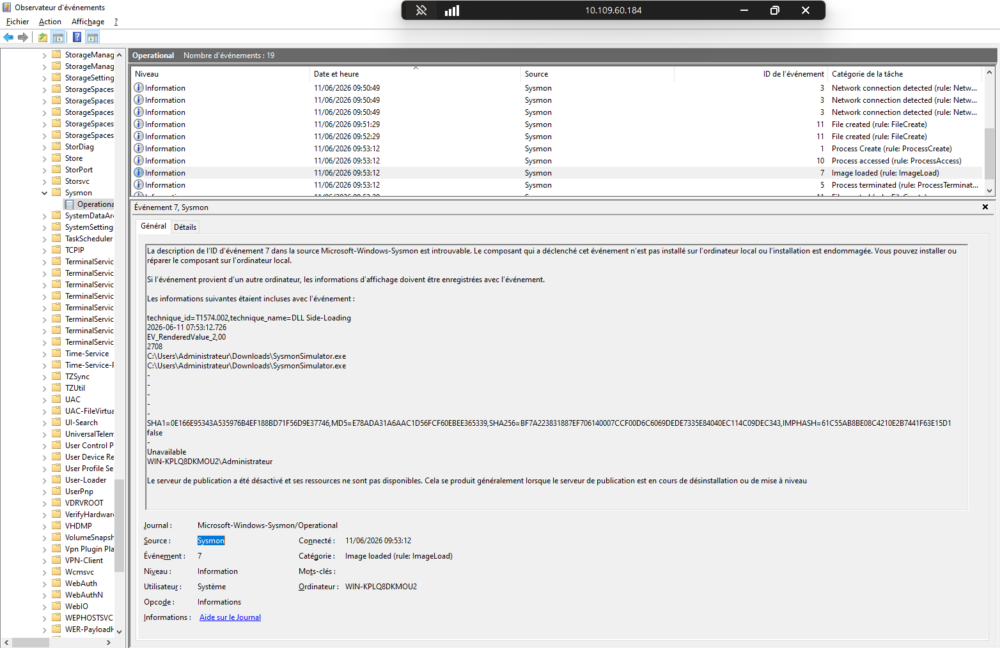
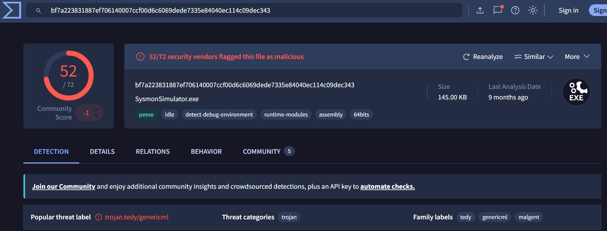

+++
author = "Enzo"
title = "Sysmon"
date = "2026-06-11"
categories = [
    "Blue Team"
]
tags = [
    "Windows",
    "Linux",
    "Log",
    "Cours"
]
+++

## Introduction

``Sysmon`` est un service qui permet l'enrichissement des logs afin de détecter plus rapidement et simplement les attaques et/ou problème logiciel.

Il nous permet de monitorer ces différents systèmes : 
- Processus 
- Système de fichiers
- Registre
- Réseau
  
On pourrait se dire que la journalisation Windows est suffisante, mais non, elle est trop "complexe" il faut chercher dans les sous dossiers de sous dossiers pour trouver une info, pour certaines il faut activer la fonctionnalité de logging etc. Elle n'est pas du pratique.    
## Installation 

Pour installer ``Sysmon`` sur son Windows il faut se rendre sur le site de de Microsoft au lieu suivant : 
https://learn.microsoft.com/en-us/sysinternals/downloads/sysmon

En suite il faut appuyer sur "Download Sysmon", le téléchargement se lance. 

Une fois le téléchargement finit, il nous suffira de dézipper le fichier puis de configurer la journalisation des événements. 
## Configuration

``Sysmon`` s'appuis sur `XML` pour son fichier de configuration. Toute sa configuration se fera via un fichier `<name>.xml`

### Construction du fichier de configuration

Une fois notre dossier Sysmon dézippé, il nous suffit de créer notre fichier de conf (pour moi ce sera `sysmon-config.xml`). Une fois créé nous pouvons commencer la configuration : 
```XML
<Sysmon schemaversion="4.91">
    <HashAlgorithms>md5,sha256</HashAlgorithms>
    <EventFiltering>
        <RuleGroup name="Journalisation de Processus" groupRelation="or">
            <ProcessCreate onmatch="include">
                <Image condition="contains">cmd.exe</Image>
                <Image condition="contains">powershell.exe</Image>
                <Image condition="contains">pwsh.exe</Image>
            </ProcessCreate>
        </RuleGroup>
        <RuleGroup name="Journalisation du Reseau" groupRelation="or">
            <NetworkConnect onmatch="include">
                <Image condition="contains">powershell</Image>
                <Image condition="contains">cmd</Image>
                <DestinationPort condition="is">80</DestinationPort>
                <DestinationPort condition="is">443</DestinationPort>
                <DestinationPort condition="is">4443</DestinationPort>
                <DestinationPort condition="is">4444</DestinationPort>
                <DestinationPort condition="is">8080</DestinationPort>
                <DestinationPort condition="is">8081</DestinationPort>
            </NetworkConnect>
        </RuleGroup>
    </EventFiltering>
</Sysmon>
```
### Explication de la configuration

```xml
<Sysmon schemaversion="4.91">
```
 - Déclare qu'on utilise le schéma version 4.91 de ``Sysmon``.

```xml
<HashAlgorithms>md5,sha256</HashAlgorithms>
```
 - Pour chaque processus créé, ``Sysmon`` calculera et loggera le hash MD5 ET SHA256 de l'exécutable. Utile pour identifier un binaire malveillant (comparaison avec VirusTotal par exemple).
#### RuleGroup 1
---
```xml
<RuleGroup name="Journalisation de Processus" groupRelation="or">
```
 - `groupRelation="or"` → une seule condition suffit pour déclencher le log.

```xml
<ProcessCreate onmatch="include">
```
 - On surveille l'Event ID 1 (création de processus). `onmatch="include"` → on logue uniquement ce qui correspond aux règles ci-dessous.

```xml
<Image condition="contains">cmd.exe</Image>
<Image condition="contains">powershell.exe</Image>
<Image condition="contains">pwsh.exe</Image>
```
 - `Image` = le chemin complet de l'exécutable. On capture donc tout lancement de :

| Processus        | Usage                |
| ---------------- | -------------------- |
| `cmd.exe`        | Invite de commandes  |
| `powershell.exe` | PowerShell classique |
| `pwsh.exe`       | PowerShell 7+        |

#### RuleGroup 2
---
```xml
<RuleGroup name="Journalisation du Reseau" groupRelation="or">
```
 - Même logique `or` → si une des conditions match, on logue.

```xml
<NetworkConnect onmatch="include">
```
 - On surveille l'Event ID 3 (connexion réseau initiée).

```xml
<Image condition="contains">powershell</Image>
<Image condition="contains">cmd</Image>
```
 - Toute connexion réseau initiée par PowerShell ou CMD sera loggée.

```xml
<DestinationPort condition="is">80</DestinationPort>
<DestinationPort condition="is">443</DestinationPort>
<DestinationPort condition="is">4443</DestinationPort>
<DestinationPort condition="is">4444</DestinationPort>
<DestinationPort condition="is">8080</DestinationPort>
<DestinationPort condition="is">8081</DestinationPort>
```
 - Ces ports sont loggés quel que soit le processus qui s'y connecte.
--- 
Attention à bien fermer TOUTES les balises.
## Utilisation

Pour commencé et affecter les "règles" de journalisation il faut lancer la commande suivante :
```` Powershell
PS C:\Users\Administrateur\Downloads\Sysmon> .\Sysmon64.exe -accepteula -i .\sysmon-config.xml

System Monitor v15.20 - System activity monitor
By Mark Russinovich and Thomas Garnier
Copyright (C) 2014-2026 Microsoft Corporation
Using libxml2. libxml2 is Copyright (C) 1998-2012 Daniel Veillard. All Rights Reserved.
Sysinternals - www.sysinternals.com

Loading configuration file with schema version 4.91
Configuration file validated.
Sysmon64 installed.
SysmonDrv installed.
Starting SysmonDrv.
SysmonDrv started.
Starting Sysmon64..
Sysmon64 started.
````

Les logs généré par ``Sysmon`` sont visible dans l' ``observateur d'événements`` au chemin suivant : 
``Journaux des applications > Microsoft > Windows > Sysmon > Operational``  

Pour tester ces règles, j'ai simplement ouvert un ``powershell`` et on voit tout de suite dans les logs de ``Sysmon`` qu'un ``powershell`` a été ouvert :



Nous pouvons également tester avec une requête web : 
```Poweshell
Test-NetConnection xn--kirn-xqa.fr -Port 443


ComputerName     : xn--kirn-xqa.fr
RemoteAddress    : 75.2.60.5
RemotePort       : 443
InterfaceAlias   : Ethernet0
SourceAddress    : 10.109.60.184
TcpTestSucceeded : True
```

Et voici le résultat dans mes logs : 
```Powershell
Get-WinEvent -LogName "Microsoft-Windows-Sysmon/Operational" |
    Where-Object { $_.Id -eq 3 } |
    ForEach-Object {
        $xml = [xml]$_.ToXml()
        $data = $xml.Event.EventData.Data
        $props = [ordered]@{ TimeCreated = $_.TimeCreated }
        $data | ForEach-Object { $props[$_.Name] = $_.'#text' }
        [PSCustomObject]$props
    } | Format-List
    

TimeCreated         : 11/06/2026 09:15:09
RuleName            : Journalisation du Reseau
UtcTime             : 2026-06-11 07:15:07.345
ProcessGuid         : {1bc7b0f3-6e07-6a29-3801-000000000800}
ProcessId           : 1708
Image               : C:\Windows\System32\WindowsPowerShell\v1.0\powershell.exe
User                : WIN-KPLQ8DKMOU2\Administrateur
Protocol            : tcp
Initiated           : true
SourceIsIpv6        : false
SourceIp            : 10.109.60.184
SourceHostname      : WIN-KPLQ8DKMOU2.pimead.fr
SourcePort          : 50336
SourcePortName      : -
DestinationIsIpv6   : false
DestinationIp       : 75.2.60.5
DestinationHostname : acd89244c803f7181.awsglobalaccelerator.com
DestinationPort     : 443
DestinationPortName : https
```

Nous pouvons également aller voir dans l'observateur d'événements mais il se peut qu'on voit une erreur (qui ne change rien à la fonctionnalité des logs, juste c'est moins beau) : 


## SysmonConfig Communautaire
Nous avons la possibilité d'utiliser des fichiers de configuration disponible sur GitHub (ou autre), personnellement, j'aime beaucoup celui de Olaf Harton, il nous permet de "trier" les logs par TTP :
[raw.githubusercontent.com/olafhartong/sysmon-modular/refs/heads/master/sysmonconfig.xml](https://raw.githubusercontent.com/olafhartong/sysmon-modular/refs/heads/master/sysmonconfig.xml)

Une fois téléchargé, il faut mettre la jour la conf du `Sysmon` avec la commande Powershell suivante : 
```Powershell
.\Sysmon64.exe -c <name>.xml
```

Voici un résultat de log avec ce fichier de configuration : 
```evtx
La description de l’ID d’événement 11 dans la source Microsoft-Windows-Sysmon est introuvable. Le composant qui a déclenché cet événement n’est pas installé sur l’ordinateur local ou l’installation est endommagée. Vous pouvez installer ou réparer le composant sur l’ordinateur local.

Si l’événement provient d’un autre ordinateur, les informations d’affichage doivent être enregistrées avec l’événement.

Les informations suivantes étaient incluses avec l’événement : 

technique_id=T1574.010,technique_name=Services File Permissions Weakness
2026-06-11 07:33:42.508
EV_RenderedValue_2,00
4
System
C:\Windows\System32\LogFiles\WMI\RtBackup\EtwRTSysmonDnsEtwSession.etl
2026-06-11 07:33:42.508
AUTORITE NT\Système

Le serveur de publication a été désactivé et ses ressources ne sont pas disponibles. Cela se produit généralement lorsque le serveur de publication est en cours de désinstallation ou de mise à niveau
```

## Test des règles
Pour tester tester nos règles nous pouvons utiliser `SysmonSimulator` qui va nous créer des logs avec certains `Event ID` qui vont être détecté comme malicieux. Voici le repo GitHub du SysmonSimulator : 
[GitHub - ScarredMonk/SysmonSimulator: Sysmon event simulation utility which can be used to simulate the attacks to generate the Sysmon Event logs for testing the EDR detections and correlation rules by Blue teams. · GitHub](https://github.com/ScarredMonk/SysmonSimulator)

Il suffit de le télécharger et de le lancer sur notre machine. 
Pour voir ce que l'on peut faire nous pouvons faire une 
```Powershell
.\SysmonSimulatoe.exe -h
 __                        __
(_      _ ._ _   _  ._    (_  o ._ _      |  _. _|_  _  ._
__) \/ _> | | | (_) | |   __) | | | | |_| | (_|  |_ (_) |
    /
                                            by @ScarredMonk

Sysmon Simulator v0.1 - Sysmon event simulation utility
    A Windows utility to simulate Sysmon event logs

Usage:
Run simulation : .\SysmonSimulator.exe -eid <event id>
Show help menu : .\SysmonSimulator.exe -help

Example:
SysmonSimulator.exe -eid 1

Parameters:
-eid 1  : Process creation
-eid 2  : A process changed a file creation time
-eid 3  : Network connection
-eid 5  : Process terminated
-eid 6  : Driver loaded
-eid 7  : Image loaded
-eid 8  : CreateRemoteThread
-eid 9  : RawAccessRead
-eid 10 : ProcessAccess
-eid 11 : FileCreate
-eid 12 : RegistryEvent - Object create and delete
-eid 13 : RegistryEvent - Value Set
-eid 14 : RegistryEvent - Key and Value Rename
-eid 15 : FileCreateStreamHash
-eid 16 : ServiceConfigurationChange
-eid 17 : PipeEvent - Pipe Created
-eid 18 : PipeEvent - Pipe Connected
-eid 19 : WmiEvent - WmiEventFilter activity detected
-eid 20 : WmiEvent - WmiEventConsumer activity detected
-eid 21 : WmiEvent - WmiEventConsumerToFilter activity detected
-eid 22 : DNSEvent - DNS query
-eid 24 : ClipboardChange - New content in the clipboard
-eid 25 : ProcessTampering - Process image change
-eid 26 : FileDeleteDetected - File Delete logged

Description:
Enter an event ID from the above parameters list and the related Windows API function is called
to simulate the attack and Sysmon event log will be generated which can be viewed in the Windows Event Viewer

Prerequisite:
Sysmon must be installed on the system
```

Ici, en guise de teste, nous allons utiliser l'`Event ID` 6, le chargement de driver :
```Powershell
.\SysmonSimulator.exe -eid 6

[+] Event ID     : 6
[+] Event Name   : Driver Load Event

Steps to generate Driver Load event log:

 -> Go to Settings >> Windows Security >> Virus & threat protection settings
 -> Disable Real-time protection
 -> Enable Real-time protection

 This will load C:\Windows\System32\drivers\wd\WdNisDrv.sys which is Microsoft Network Realtime Inspection Driver file
``` 

Ici nous pouvons voir que ma règles est bien détecté : 


Si nous mettons le hash `SHA256` dans VirusTotal, nous pouvons bel et bien voir que ce fichier est un malware de type Trojan : 


