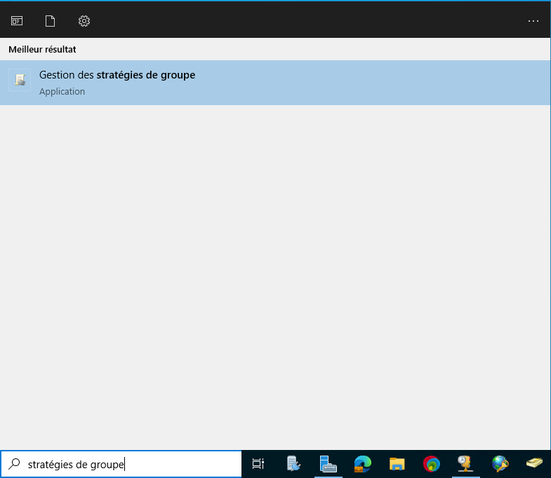
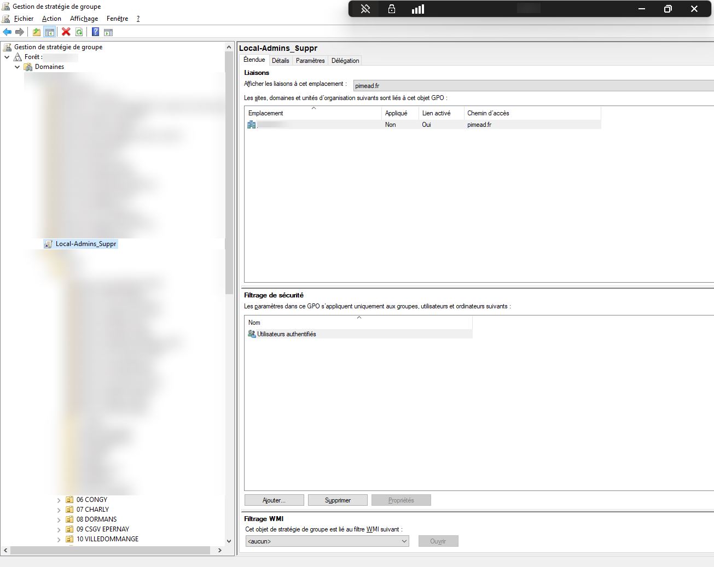
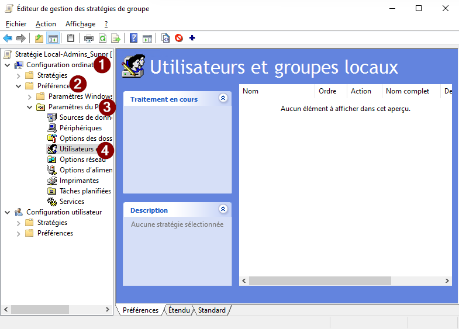
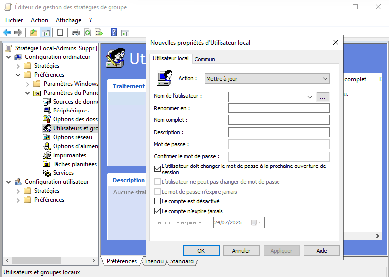
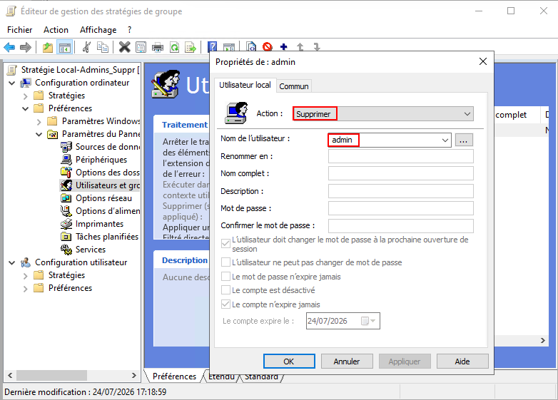

+++
author = "Enzo"
title = "GPO - Supprimer Admin Local"
date = "2026-07-27"
categories = [
    "Blue Team"
]
tags = [
    "Windows",
    "Active Directory",
    "Administrateur",
    "Local"
]
+++
# Suppression de l'administrateur local par GPO
## Pourquoi supprimer les comptes administrateurs locaux
### Réduction de la surface d'attaque
Si le compte Administrateur local existe sur toutes les machines avec un mot de passe identique ou prévisible, un attaquant ayant compromis une seule station peut :

1. Extraire le hash NTLM du compte Administrateur local (ex. via Mimikatz, sekurlsa::logonpasswords).
2. Réutiliser ce hash pour s'authentifier sur l'ensemble des autres machines du domaine.
3. Se propager latéralement jusqu'à atteindre un contrôleur de domaine ou un compte à privilèges élevés.

### Principe du moindre privilège
Le principe du moindre privilège impose qu'un utilisateur ne dispose que des droits strictement nécessaires à l'exercice de sa fonction.

Un poste de travail standard ne doit jamais nécessiter de droits d'administration locale permanente. L'administration doit être exceptionnelle, temporaire et tracée.

### Conformité réglementaire
- **ANSSI** : La directive RGS et les recommandations relatives à l'administration Windows (Note ANSSI, 2023) préconisent explicitement le désamorçage des comptes Administrateur locaux et l'usage de solutions de rotation.
- **RGPD (art. 32)** : L'obligation de sécurité implique la mise en place de mesures techniques contre la propagation d'une violation de données — un compte Administrateur local non géré constitue un tel risque.

## Pourquoi le faire via GPO
L'approche manuelle (script local, intervention physique ou connexion RDP sur chaque poste) devient ingérable dès lors qu'on dépasse quelques dizaines de machines.

Le déploiement via une GPO présente au contraire plusieurs avantages :
- Simplicité : configuration centralisée depuis un point unique
- Auditabilité : traçabilité et contrôle des paramètres appliqués
- Scalabilité : on peut ajouter autant de machines et de comptes utilisateurs que nécessaire sans effort supplémentaire

## Comment le faire ? 
Pour déployer cette GPO nous devons nous rendre sur le DC et d'y rechercher "stratégies de groupe" : 
 

Une fois dans les stratégies de groupe nous en créer une, pour ça il faut faire un clqiue droit sur le domaine voulu, puis, de cliquer sur "Créer un objet GPO [...]" et enfin, il faudra donner un nom à cette GPO. De mon côté elle se nommera "Local-Admins_Suppr": 
 

Ensuite nous devons faire un clique droit, puis, "Modifier". Une fenêtre va s'ouvrir, il faudra suivre la capture d'écran ci-dessous pour mettre en place cette GPO :

Une fois dans "Utilisateurs et groupes locaux" nous devons y faire un clique droit, puis, "Nouveau" et enfin "Utilisateur local" (ou groupe local si vous n'avez pas de procédure d'installation stricte) : 

Une fois l'utilisateur choisi, il faudra changer l'action qui "Mettre à jour" par défaut en "Supprimer", ensuite il faudra "Appliquer" l'utilisateur et puis appuyer sur "OK" pour quitter la fenêtre : 

Pour finir, il faudra "Appliquer la GPO", pour l'appliquer, il nous suffit de faire un clique droit dessus, et de cocher "Appliquer". Et voilà, la GPO sera appliquer et les comptes administrateur des postes client seront supprimé.